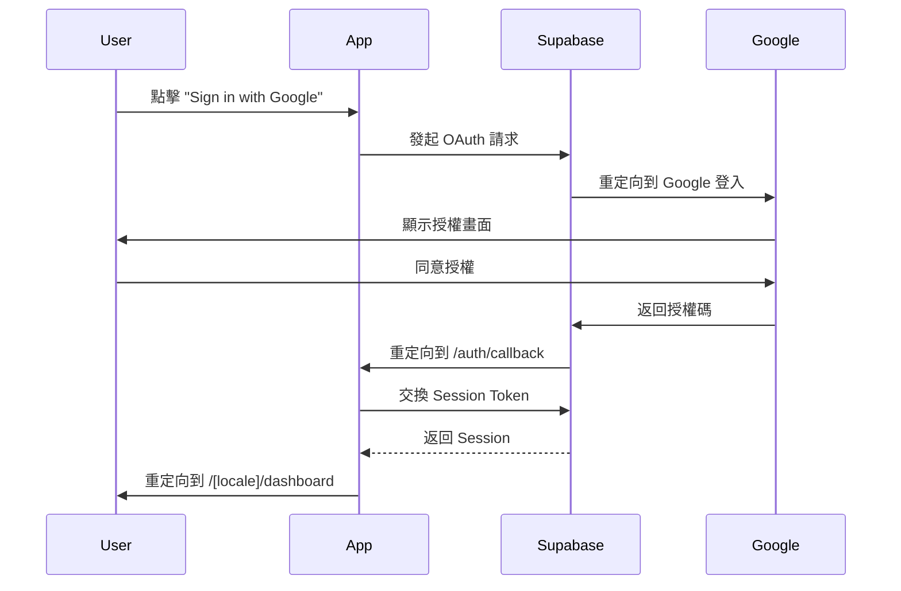

# 前端架構深度分析報告
**Quotation System Frontend Architecture Analysis**

**分析日期**: 2025-10-24  
**專案路徑**: `/Users/avyshiu/Claudecode/quotation-system`  
**當前 Commit**: `5bd94d6` - 測試: 完成核心資料系統測試，後端測試 100% 達成

---

## 📋 目錄

1. [架構概覽](#1-架構概覽)
2. [技術棧分析](#2-技術棧分析)
3. [專案結構](#3-專案結構)
4. [路由與頁面組織](#4-路由與頁面組織)
5. [元件架構](#5-元件架構)
6. [資料管理](#6-資料管理)
7. [國際化實作](#7-國際化實作)
8. [與後端的整合](#8-與後端的整合)
9. [識別的缺口](#9-識別的缺口)
10. [優先改進建議](#10-優先改進建議)

---

## 1. 架構概覽

### 1.1 整體架構模式

本專案採用 **Next.js 15 App Router** 架構，結合以下特性：

- **伺服器元件為主 (Server Components First)**: 大部分頁面使用 RSC 進行 SSR
- **客戶端互動元件 (Client Components)**: 表單和互動式 UI 使用 `'use client'`
- **混合資料獲取**: Server Components 進行初始資料載入，Client Components 處理互動
- **API Routes**: 使用 Next.js 13+ Route Handlers (`app/api/*/route.ts`)

### 1.2 資料庫架構

採用**混合架構**：

```
┌─────────────────────────────────────────────────────┐
│                   前端應用層                         │
│               Next.js 15 App Router                 │
└─────────────┬───────────────────────┬───────────────┘
              │                       │
              │                       │
    ┌─────────▼────────┐    ┌────────▼──────────┐
    │  Supabase Auth   │    │  Zeabur PostgreSQL│
    │  (認證系統)       │    │  (業務資料庫)     │
    │                  │    │                   │
    │  - Google OAuth  │    │  - 19 個資料表    │
    │  - Session 管理   │    │  - RLS 策略       │
    └──────────────────┘    │  - CRUD 操作      │
                            └───────────────────┘
```

**優勢**:
- 成本優化：認證交給 Supabase 免費方案
- 資料主權：業務資料完全自主控制
- 彈性擴展：可獨立升級認證和資料庫

---

## 2. 技術棧分析

### 2.1 核心依賴

#### 框架與執行環境
```json
{
  "next": "15.5.5",              // 最新穩定版
  "react": "19.1.0",             // React 19
  "react-dom": "19.1.0",
  "typescript": "^5"
}
```

#### UI 與樣式
```json
{
  "tailwindcss": "^4",           // Tailwind CSS v4
  "@headlessui/react": "^2.2.9"  // 無樣式 UI 元件（Combobox, Dialog 等）
}
```

#### 認證與資料庫
```json
{
  "@supabase/ssr": "^0.7.0",     // Supabase SSR 支援
  "@supabase/supabase-js": "^2.75.0",
  "pg": "^8.16.3"                // 直連 PostgreSQL (Zeabur)
}
```

#### 國際化
```json
{
  "next-intl": "^4.3.12"         // Next.js 官方推薦的 i18n 方案
}
```

#### 其他工具
```json
{
  "@react-pdf/renderer": "^4.3.1",  // PDF 產生
  "recharts": "^3.2.1",             // 圖表元件
  "nodemailer": "^7.0.9",           // 郵件發送
  "jszip": "^3.10.1"                // ZIP 壓縮
}
```

### 2.2 開發工具

```json
{
  "vitest": "^3.2.4",              // 測試框架
  "@testing-library/react": "^16.3.0",
  "msw": "^2.11.5",                // Mock Service Worker
  "eslint": "^9",
  "@tailwindcss/postcss": "^4"
}
```

### 2.3 版本分析

**優勢**:
- ✅ 全部使用最新穩定版本
- ✅ Next.js 15.5.5 + React 19 = 最新特性支援
- ✅ Tailwind CSS v4 = 最新效能優化
- ✅ TypeScript 5 = 強型別保護

**風險**:
- ⚠️ React 19 仍在早期階段，可能有破壞性變更
- ⚠️ Tailwind v4 是重大更新，語法可能需調整

---

## 3. 專案結構

### 3.1 目錄樹狀圖

```
quotation-system/
├── app/                          # Next.js 15 App Router
│   ├── [locale]/                 # 國際化路由
│   │   ├── dashboard/            # 儀表板
│   │   ├── quotations/           # 報價單管理
│   │   ├── customers/            # 客戶管理
│   │   ├── products/             # 產品管理
│   │   ├── contracts/            # 合約管理
│   │   ├── payments/             # 付款管理
│   │   ├── settings/             # 系統設定
│   │   └── layout.tsx            # 主要 layout
│   ├── api/                      # API Routes (43 個路由)
│   │   ├── quotations/
│   │   ├── customers/
│   │   ├── products/
│   │   ├── contracts/
│   │   ├── payments/
│   │   ├── admin/
│   │   └── ...
│   ├── admin/                    # 管理控制台
│   ├── auth/                     # 認證相關
│   ├── login/                    # 登入頁面
│   ├── globals.css
│   ├── layout.tsx
│   └── page.tsx
│
├── components/                   # 共用元件 (25 個)
│   ├── ui/                       # 基礎 UI 元件
│   │   ├── PageHeader.tsx
│   │   ├── FormInput.tsx
│   │   ├── BilingualFormInput.tsx
│   │   ├── LoadingSpinner.tsx
│   │   ├── EmptyState.tsx
│   │   └── DeleteConfirmModal.tsx
│   ├── charts/                   # 圖表元件
│   ├── admin/                    # 管理員專用元件
│   ├── permission/               # 權限管理元件
│   ├── contracts/
│   ├── payments/
│   ├── products/
│   ├── Navbar.tsx
│   ├── Sidebar.tsx
│   ├── CompanySelector.tsx
│   ├── DashboardCharts.tsx
│   └── PDFDownloadButton.tsx
│
├── hooks/                        # 自訂 Hooks (13 個)
│   ├── admin/                    # 管理員 Hooks
│   │   ├── useAdminUsers.ts
│   │   ├── useAdminCompanies.ts
│   │   ├── useAdminStats.ts
│   │   └── ...
│   ├── permission/               # 權限 Hooks
│   │   ├── usePermissions.ts
│   │   ├── useCompanies.ts
│   │   ├── useCompanyMembers.ts
│   │   └── useManageableCompanies.ts
│   ├── useContracts.ts
│   ├── usePayments.ts
│   └── usePermission.ts
│
├── lib/                          # 工具函數與服務層
│   ├── supabase/                 # Supabase 客戶端
│   │   ├── client.ts             # 瀏覽器端
│   │   ├── server.ts             # 伺服器端
│   │   └── middleware.ts
│   ├── services/                 # 業務邏輯層
│   │   ├── database.ts           # 資料庫操作
│   │   ├── rbac.ts               # 權限管理
│   │   ├── analytics.ts          # 分析統計
│   │   ├── contracts.ts
│   │   ├── payments.ts
│   │   ├── company.ts
│   │   └── exchange-rate.ts
│   ├── middleware/               # 中介層
│   │   ├── withAuth.ts
│   │   ├── withPermission.ts
│   │   └── rate-limiter.ts
│   ├── security/                 # 安全模組
│   │   ├── field-validator.ts
│   │   └── csrf.ts
│   ├── pdf/                      # PDF 產生
│   ├── db/                       # 資料庫連線
│   ├── errors/                   # 錯誤處理
│   ├── logger/                   # 日誌記錄
│   └── utils/                    # 通用工具
│
├── types/                        # TypeScript 型別定義
│   ├── database.types.ts         # Supabase 自動生成
│   ├── extended.types.ts         # 擴充型別（607 行）
│   └── rbac.types.ts
│
├── messages/                     # 國際化翻譯檔
│   ├── en.json                   # 英文 (422 行)
│   └── zh.json                   # 繁體中文 (422 行)
│
├── i18n/                         # 國際化設定
│   ├── request.ts
│   └── routing.ts
│
├── tests/                        # 測試檔案
│   ├── unit/
│   ├── integration/
│   └── e2e/
│
├── scripts/                      # 腳本工具 (124 個腳本)
│   ├── test-*.ts                 # 測試腳本
│   ├── seed-*.ts                 # 資料種子
│   └── migrate-*.ts              # 遷移腳本
│
├── middleware.ts                 # Next.js 中介層
├── next.config.ts
├── tsconfig.json
├── tailwind.config.ts
├── package.json
└── vitest.config.ts
```

### 3.2 檔案統計

| 類別 | 數量 | 說明 |
|------|------|------|
| 頁面元件 | 31 個 | `app/[locale]` 下的 `.tsx` 檔案 |
| 共用元件 | 25 個 | `components/` 下的元件 |
| API 路由 | 43 個 | `app/api/*/route.ts` |
| 自訂 Hooks | 13 個 | `hooks/` 目錄 |
| 服務層 | 10 個 | `lib/services/` |
| 型別定義 | 3 個主檔 | `types/` 目錄 |
| 測試腳本 | 124 個 | `scripts/` 目錄 |
| 多語系鍵值 | 422 行 | 每個語言檔案 |

---

## 4. 路由與頁面組織

### 4.1 路由結構

#### 公開路由
```
/                      → 重定向到 /login
/login                 → 登入頁面 (Google OAuth)
/auth/callback         → OAuth 回調
```

#### 受保護路由 (需認證)
```
/[locale]/dashboard              → 儀表板
/[locale]/quotations             → 報價單列表
/[locale]/quotations/new         → 建立報價單
/[locale]/quotations/[id]        → 報價單詳情
/[locale]/quotations/[id]/edit   → 編輯報價單
/[locale]/customers              → 客戶列表
/[locale]/customers/new          → 建立客戶
/[locale]/customers/[id]         → 客戶詳情
/[locale]/products               → 產品列表
/[locale]/products/new           → 建立產品
/[locale]/products/[id]          → 產品詳情
/[locale]/contracts              → 合約管理
/[locale]/payments               → 付款記錄
/[locale]/settings               → 系統設定
```

#### 管理員路由
```
/admin                           → 管理控制台
/admin/users                     → 使用者管理
/admin/companies                 → 公司管理
```

### 4.2 國際化路由

支援的語言：
- `en` - 英文
- `zh` - 繁體中文

**實作方式**:
```typescript
// i18n/request.ts
export const locales = ['en', 'zh'] as const
export type Locale = (typeof locales)[number]

// middleware.ts
const intlMiddleware = createMiddleware(routing)
```

**範例**:
```
/en/dashboard  → 英文儀表板
/zh/dashboard  → 中文儀表板
```

### 4.3 頁面載入模式

| 頁面類型 | 渲染模式 | 資料獲取 | 範例 |
|---------|---------|---------|------|
| 儀表板 | SSR (force-dynamic) | Server Component | `dashboard/page.tsx` |
| 報價單列表 | SSR (force-dynamic) | Server Component | `quotations/page.tsx` |
| 報價單表單 | CSR (Client Component) | Client-side fetch | `QuotationForm.tsx` |
| 客戶表單 | CSR (Client Component) | Client-side fetch | `CustomerForm.tsx` |

---

## 5. 元件架構

### 5.1 元件分類

#### 5.1.1 基礎 UI 元件 (`components/ui/`)

| 元件名稱 | 用途 | 特性 |
|---------|------|------|
| `PageHeader.tsx` | 頁面標題與操作按鈕 | 支援 action 按鈕 |
| `FormInput.tsx` | 單一表單輸入 | 受控元件 |
| `BilingualFormInput.tsx` | 雙語輸入欄位 | 中英文並排輸入 |
| `LoadingSpinner.tsx` | 載入動畫 | - |
| `EmptyState.tsx` | 空狀態提示 | - |
| `DeleteConfirmModal.tsx` | 刪除確認對話框 | 使用 Headless UI |

**特點**:
- ✅ 高度可重用
- ✅ TypeScript 型別完整
- ✅ 支援 Tailwind CSS 樣式
- ⚠️ 缺少 Toast/Notification 元件
- ⚠️ 缺少 Button 元件（直接寫 HTML）

#### 5.1.2 業務元件

**報價單相關**:
```typescript
// app/[locale]/quotations/
QuotationList.tsx         // 報價單列表（Client Component）
QuotationForm.tsx         // 報價單表單（838 行，功能完整）
QuotationDetail.tsx       // 報價單詳情
QuotationEditForm.tsx     // 編輯表單
```

**客戶相關**:
```typescript
// app/[locale]/customers/
CustomerList.tsx          // 客戶列表
CustomerForm.tsx          // 客戶表單（165 行）
```

**產品相關**:
```typescript
// app/[locale]/products/
ProductList.tsx           // 產品列表
ProductForm.tsx           // 產品表單
```

**合約與付款**:
```typescript
// components/contracts/
// components/payments/
```

#### 5.1.3 進階 UI 元件

| 元件 | 依賴 | 用途 |
|------|------|------|
| `Combobox` | @headlessui/react | 下拉選單（客戶、產品選擇） |
| `Dialog` | @headlessui/react | 對話框 |
| Charts | recharts | 圖表視覺化 |

### 5.2 表單元件分析

#### QuotationForm.tsx (核心元件)

**行數**: 838 行  
**複雜度**: 高

**功能特性**:
- ✅ 客戶選擇 (Combobox + 搜尋)
- ✅ 產品選擇 (Combobox + 搜尋)
- ✅ 多貨幣支援 (TWD, USD, EUR, JPY, CNY)
- ✅ 即時匯率轉換 (ExchangeRate-API)
- ✅ 動態項目管理 (新增/刪除/編輯)
- ✅ 自動計算小計、稅額、總計
- ✅ 備註模版管理 (標準/急件/批發/維護)
- ✅ 自訂備註模版 (LocalStorage)
- ✅ 表單驗證

**優點**:
- 功能完整，涵蓋所有業務需求
- UX 良好，支援搜尋和快速新增
- 貨幣轉換邏輯清晰

**缺點**:
- ⚠️ 檔案過大 (838 行)，應拆分
- ⚠️ 狀態管理複雜，應考慮 useReducer
- ⚠️ 缺少錯誤邊界處理
- ⚠️ 匯率 API 失敗時缺少降級策略

**建議重構**:
```typescript
// 拆分為多個子元件
QuotationForm/
  ├── CustomerSelector.tsx
  ├── ProductSelector.tsx
  ├── ItemsTable.tsx
  ├── PricingSummary.tsx
  ├── NotesEditor.tsx
  └── index.tsx
```

#### CustomerForm.tsx & ProductForm.tsx

**行數**: 165 行 / 類似  
**複雜度**: 中等

**特點**:
- ✅ 雙語輸入支援
- ✅ 表單驗證
- ✅ 錯誤處理
- ✅ Loading 狀態

**優點**:
- 程式碼簡潔易懂
- 使用共用元件 (BilingualFormInput)

---

## 6. 資料管理

### 6.1 資料獲取模式

#### 伺服器端資料獲取 (Server Components)

```typescript
// app/[locale]/quotations/page.tsx
export default async function QuotationsPage() {
  const supabase = await createClient()
  const { data: { user } } = await supabase.auth.getUser()
  
  // 使用 Zeabur PostgreSQL 獲取資料
  const quotations = await getQuotations(user.id)
  
  return <QuotationList quotations={quotations} />
}
```

**優點**:
- ✅ 伺服器端渲染，SEO 友善
- ✅ 資料安全性高
- ✅ 減少客戶端請求

#### 客戶端資料獲取 (Client Components)

```typescript
// hooks/useContracts.ts
export function useContracts() {
  const [contracts, setContracts] = useState([])
  const [loading, setLoading] = useState(true)
  
  const fetchContracts = async () => {
    const response = await fetch('/api/contracts')
    const data = await response.json()
    setContracts(data.contracts)
  }
  
  useEffect(() => {
    fetchContracts()
  }, [])
  
  return { contracts, loading, refresh: fetchContracts }
}
```

**優點**:
- ✅ 互動性強
- ✅ 支援即時重新整理

**缺點**:
- ⚠️ 缺少快取機制
- ⚠️ 缺少錯誤重試
- ⚠️ 缺少樂觀更新

### 6.2 狀態管理

**目前方式**: React Hooks (`useState`, `useEffect`)

**使用場景**:
- 表單狀態 (FormData)
- 列表資料 (useContracts, usePayments)
- Loading / Error 狀態

**缺口**:
- ❌ **缺少全域狀態管理** (Redux, Zustand, Jotai)
- ❌ **缺少資料快取** (React Query, SWR)
- ❌ **缺少樂觀更新** (Optimistic Updates)
- ❌ **缺少離線支援**

### 6.3 自訂 Hooks 清單

#### Admin Hooks (`hooks/admin/`)
```typescript
useAdminUsers.ts         // 管理員使用者列表
useAdminUserDetail.ts    // 使用者詳情
useAdminCompanies.ts     // 公司列表
useAdminCompanyDetail.ts // 公司詳情
useAdminStats.ts         // 統計資料
```

#### Permission Hooks (`hooks/permission/`)
```typescript
usePermissions.ts        // 權限檢查
useCompanies.ts          // 公司列表
useCompanyMembers.ts     // 成員管理
useManageableCompanies.ts // 可管理公司
```

#### Business Hooks
```typescript
useContracts.ts          // 合約管理
usePayments.ts           // 付款記錄
usePermission.ts         // 權限驗證
```

**特點**:
- ✅ 良好的封裝
- ✅ 提供 loading / error 狀態
- ✅ 支援 refresh 功能

**建議改進**:
- 新增 `useDebounce` Hook (搜尋優化)
- 新增 `useLocalStorage` Hook (持久化)
- 新增 `useInfiniteScroll` Hook (分頁)

### 6.4 API 路由架構

**總數**: 43 個 API Routes

#### 主要 API 端點

**報價單**:
```
POST   /api/quotations              # 建立報價單
GET    /api/quotations              # 取得報價單列表
PUT    /api/quotations/[id]         # 更新報價單
DELETE /api/quotations/[id]         # 刪除報價單
```

**客戶**:
```
POST   /api/customers               # 建立客戶
GET    /api/customers               # 取得客戶列表
PUT    /api/customers/[id]          # 更新客戶
DELETE /api/customers/[id]          # 刪除客戶
```

**產品**:
```
POST   /api/products                # 建立產品
GET    /api/products                # 取得產品列表
PUT    /api/products/[id]           # 更新產品
DELETE /api/products/[id]           # 刪除產品
```

**合約**:
```
POST   /api/contracts/from-quotation         # 從報價單建立合約
GET    /api/contracts/overdue                # 取得逾期合約
PUT    /api/contracts/[id]/next-collection   # 更新下次收款日期
GET    /api/contracts/[id]/payment-progress  # 收款進度
```

**付款**:
```
POST   /api/payments                # 記錄付款
GET    /api/payments/collected      # 已收款記錄
GET    /api/payments/unpaid         # 未收款記錄
POST   /api/payments/[id]/mark-overdue # 標記逾期
POST   /api/payments/reminders      # 發送提醒
```

**管理員**:
```
GET    /api/admin/users             # 使用者管理
PUT    /api/admin/users/[id]/role   # 角色指派
GET    /api/admin/companies         # 公司管理
```

**其他**:
```
GET    /api/exchange-rates          # 匯率查詢
GET    /api/company-settings        # 公司設定
GET    /api/rbac/user-profile       # 使用者資料
```

**安全性措施**:
- ✅ 所有 API 都有認證檢查 (Supabase Auth)
- ✅ 使用 `user_id` 進行資料隔離
- ✅ 參數化查詢防止 SQL Injection
- ✅ 欄位白名單驗證 (`field-validator.ts`)

**缺口**:
- ⚠️ 缺少統一的錯誤處理中介層
- ⚠️ 缺少 Rate Limiting (部分路由有)
- ⚠️ 缺少請求驗證 Schema (如 Zod)
- ⚠️ 缺少 API 版本控制

---

## 7. 國際化實作

### 7.1 i18n 架構

**使用套件**: `next-intl` v4.3.12

**設定檔**:
```typescript
// i18n/request.ts
export const locales = ['en', 'zh'] as const

export default getRequestConfig(async ({ requestLocale }) => {
  let locale = await requestLocale
  if (!locale || !locales.includes(locale as Locale)) {
    locale = 'en'
  }
  return {
    locale,
    messages: (await import(`@/messages/${locale}.json`)).default,
  }
})
```

### 7.2 翻譯檔案結構

**檔案大小**: 422 行 (每個語言)

**結構範例**:
```json
{
  "nav": {
    "dashboard": "Dashboard",
    "quotations": "Quotations",
    "customers": "Customers",
    "products": "Products"
  },
  "quotation": {
    "title": "Quotations",
    "createNew": "Create Quotation",
    "customer": "Customer",
    "selectCustomer": "Select customer...",
    "items": "Line Items",
    "addItem": "Add Item"
  },
  "currency": {
    "TWD": "TWD",
    "USD": "USD",
    "EUR": "EUR"
  }
}
```

### 7.3 使用方式

#### 伺服器端
```typescript
import { getTranslations } from 'next-intl/server'

export default async function Page() {
  const t = await getTranslations()
  return <h1>{t('nav.dashboard')}</h1>
}
```

#### 客戶端
```typescript
'use client'
import { useTranslations } from 'next-intl'

export default function Component() {
  const t = useTranslations()
  return <h1>{t('nav.dashboard')}</h1>
}
```

### 7.4 多語言資料處理

**資料庫欄位** (JSONB):
```typescript
interface Customer {
  name: { zh: string; en: string }
  address: { zh: string; en: string }
  contact_person: { zh: string; en: string }
}
```

**UI 元件** (`BilingualFormInput.tsx`):
```typescript
<BilingualFormInput
  label={t('customer.name')}
  name="name"
  valueZh={formData.nameZh}
  valueEn={formData.nameEn}
  onChangeZh={(value) => setFormData({ ...formData, nameZh: value })}
  onChangeEn={(value) => setFormData({ ...formData, nameEn: value })}
/>
```

**優點**:
- ✅ 完整的雙語支援
- ✅ 資料庫層級的多語言儲存
- ✅ UI 層級的並排輸入

**缺口**:
- ⚠️ 缺少語言切換 UI (Navbar 可能有但未檢視)
- ⚠️ 缺少 RTL 支援
- ⚠️ 翻譯檔案缺少型別定義

---

## 8. 與後端的整合

### 8.1 認證流程



**實作位置**:
- `app/login/page.tsx` - 登入頁面
- `app/auth/callback/route.ts` - OAuth 回調
- `middleware.ts` - Session 刷新

**Session 管理**:
```typescript
// middleware.ts
export async function middleware(request: NextRequest) {
  // 建立 Supabase 客戶端
  const supabase = createServerClient(...)
  
  // 刷新 Session
  await supabase.auth.getUser()
  
  return response
}
```

### 8.2 資料庫連接

#### Supabase Auth (認證)
```typescript
// lib/supabase/server.ts
export async function createClient() {
  const cookieStore = await cookies()
  return createServerClient(
    process.env.NEXT_PUBLIC_SUPABASE_URL!,
    process.env.NEXT_PUBLIC_SUPABASE_ANON_KEY!,
    { cookies: { ... } }
  )
}
```

#### Zeabur PostgreSQL (資料)
```typescript
// lib/db/zeabur.ts
import { Pool } from 'pg'

export const getZeaburPool = () => {
  return new Pool({
    connectionString: process.env.ZEABUR_DATABASE_URL
  })
}
```

#### 服務層範例
```typescript
// lib/services/database.ts
export async function getCustomers(userId: string): Promise<Customer[]> {
  const result = await query(
    'SELECT * FROM customers WHERE user_id = $1 ORDER BY created_at DESC',
    [userId]
  )
  return result.rows
}

export async function createCustomer(data: CustomerData): Promise<Customer> {
  const result = await query(
    `INSERT INTO customers (user_id, name, email, phone, address)
     VALUES ($1, $2, $3, $4, $5) RETURNING *`,
    [data.user_id, data.name, data.email, data.phone, data.address]
  )
  return result.rows[0]
}
```

### 8.3 API 呼叫模式

**標準模式**:
```typescript
// Client Component 中
const handleSubmit = async (e: React.FormEvent) => {
  e.preventDefault()
  setIsSubmitting(true)
  
  try {
    const response = await fetch('/api/customers', {
      method: 'POST',
      headers: { 'Content-Type': 'application/json' },
      body: JSON.stringify(customerData),
    })
    
    if (!response.ok) {
      throw new Error('Failed to save customer')
    }
    
    router.push(`/${locale}/customers`)
    router.refresh()
  } catch (err) {
    setError(err.message)
  } finally {
    setIsSubmitting(false)
  }
}
```

**Custom Hooks 模式**:
```typescript
// hooks/useContracts.ts
export function useContracts() {
  const [contracts, setContracts] = useState([])
  const [loading, setLoading] = useState(true)
  const [error, setError] = useState(null)
  
  const fetchContracts = useCallback(async () => {
    try {
      setLoading(true)
      const response = await fetch('/api/contracts')
      const data = await response.json()
      setContracts(data.contracts)
    } catch (err) {
      setError(err)
    } finally {
      setLoading(false)
    }
  }, [])
  
  useEffect(() => {
    fetchContracts()
  }, [fetchContracts])
  
  return { contracts, loading, error, refresh: fetchContracts }
}
```

### 8.4 整合狀態

| 功能模組 | 後端 API | 前端頁面 | 狀態 |
|---------|---------|---------|------|
| 報價單管理 | ✅ 完整 | ✅ 完整 | **100%** |
| 客戶管理 | ✅ 完整 | ✅ 完整 | **100%** |
| 產品管理 | ✅ 完整 | ✅ 完整 | **100%** |
| 合約管理 | ✅ 完整 | ⚠️ 基礎 | **60%** |
| 付款管理 | ✅ 完整 | ⚠️ 基礎 | **60%** |
| 公司設定 | ✅ 完整 | ✅ 完整 | **100%** |
| 儀表板分析 | ✅ 完整 | ✅ 完整 | **100%** |
| 權限管理 (RBAC) | ✅ 完整 | ⚠️ 部分 | **40%** |
| 管理員控制台 | ✅ 完整 | ⚠️ 部分 | **50%** |

**說明**:
- ✅ **完整**: 前後端完全整合，功能完善
- ⚠️ **基礎**: API 完整，但前端 UI 較簡陋
- ⚠️ **部分**: 部分功能未完成

---

## 9. 識別的缺口

### 9.1 架構層級

#### 狀態管理
- ❌ **缺少全域狀態管理**
  - 目前：每個元件獨立管理狀態
  - 問題：使用者資訊、公司資訊在多處重複獲取
  - 建議：使用 Zustand 或 Jotai

- ❌ **缺少資料快取**
  - 目前：每次都重新 fetch
  - 問題：效能浪費、使用者體驗差
  - 建議：使用 React Query 或 SWR

#### 錯誤處理
- ❌ **缺少統一錯誤處理**
  - 目前：每個 API 呼叫獨立處理錯誤
  - 問題：錯誤訊息不一致、缺少日誌
  - 建議：建立統一的 Error Boundary 和 API 錯誤處理

- ❌ **缺少錯誤追蹤**
  - 建議：整合 Sentry 或類似工具

#### Loading 狀態
- ❌ **缺少 Skeleton Loader**
  - 目前：使用 LoadingSpinner
  - 問題：使用者體驗不佳
  - 建議：使用 Skeleton UI 提升載入體驗

### 9.2 元件層級

#### 缺少的基礎元件
```
❌ Button 元件          # 目前直接寫 HTML
❌ Toast/Notification   # 缺少提示訊息
❌ Dropdown 元件        # 僅用 Headless UI
❌ Tabs 元件            # 某些頁面可能需要
❌ Card 元件            # 容器元件
❌ Badge 元件           # 狀態標籤
❌ Pagination 元件      # 分頁功能
❌ DatePicker 元件      # 目前用原生 input type="date"
```

#### 表單處理
- ❌ **缺少表單驗證庫**
  - 目前：手動驗證
  - 建議：使用 React Hook Form + Zod

- ❌ **缺少表單狀態管理**
  - 目前：每個表單獨立管理
  - 建議：統一的表單 Context

### 9.3 功能層級

#### 使用者體驗
- ⚠️ **搜尋功能**
  - 部分頁面有搜尋，但缺少防抖 (debounce)
  - 建議：建立 `useDebounce` Hook

- ⚠️ **分頁功能**
  - 目前：顯示所有資料
  - 問題：資料量大時效能差
  - 建議：實作 Server-side Pagination

- ❌ **排序與過濾**
  - 缺少列表排序功能
  - 缺少進階過濾器

- ❌ **批次操作**
  - 缺少批次刪除
  - 缺少批次匯出

#### 資料視覺化
- ⚠️ **圖表功能**
  - 已有 recharts，但僅用於儀表板
  - 建議：擴展到其他報表頁面

- ❌ **匯出功能**
  - 已有 PDF 匯出，但缺少 Excel/CSV
  - 建議：新增 Excel 匯出功能

### 9.4 效能優化

- ❌ **缺少圖片優化**
  - 建議：使用 Next.js Image 元件

- ❌ **缺少程式碼分割**
  - 建議：使用 dynamic import

- ❌ **缺少 Service Worker**
  - 建議：實作 PWA 功能

### 9.5 測試

**目前狀態**:
- ✅ 後端測試：100% (120 個測試)
- ⚠️ 前端測試：幾乎為 0

**缺少的測試**:
```
❌ 元件單元測試
❌ Hook 測試
❌ 整合測試
❌ E2E 測試
```

**建議**:
- 使用 Vitest + Testing Library
- 優先測試核心表單元件
- 實作 E2E 測試 (Playwright)

### 9.6 安全性

- ⚠️ **CSRF 保護**
  - 已有 `lib/security/csrf.ts`，但未全面應用
  - 建議：所有表單都加上 CSRF Token

- ⚠️ **XSS 防護**
  - 建議：使用 DOMPurify 清理使用者輸入

- ⚠️ **Rate Limiting**
  - 已有 `lib/middleware/rate-limiter.ts`
  - 建議：應用到所有 API

### 9.7 監控與日誌

- ❌ **缺少前端監控**
  - 建議：整合 Sentry / LogRocket

- ⚠️ **日誌系統**
  - 已有 `lib/logger/`，但使用不完整
  - 建議：統一日誌格式和輸出

---

## 10. 優先改進建議

### 10.1 立即可做（低成本高效益）

#### 1️⃣ 建立基礎 UI 元件庫 (1-2 天)

**優先級**: 🔴 高

**項目**:
```typescript
components/ui/
  ├── Button.tsx           # 統一按鈕樣式
  ├── Toast.tsx            # 提示訊息
  ├── Badge.tsx            # 狀態標籤
  ├── Card.tsx             # 容器元件
  └── Pagination.tsx       # 分頁元件
```

**範例實作**:
```typescript
// components/ui/Button.tsx
interface ButtonProps {
  variant?: 'primary' | 'secondary' | 'danger'
  size?: 'sm' | 'md' | 'lg'
  loading?: boolean
  disabled?: boolean
  children: React.ReactNode
  onClick?: () => void
}

export function Button({ 
  variant = 'primary', 
  size = 'md',
  loading = false,
  ...props 
}: ButtonProps) {
  const baseStyles = 'rounded-lg font-medium transition-colors'
  const variantStyles = {
    primary: 'bg-indigo-600 text-white hover:bg-indigo-700',
    secondary: 'bg-gray-200 text-gray-900 hover:bg-gray-300',
    danger: 'bg-red-600 text-white hover:bg-red-700'
  }
  const sizeStyles = {
    sm: 'px-3 py-1 text-sm',
    md: 'px-4 py-2',
    lg: 'px-6 py-3 text-lg'
  }
  
  return (
    <button 
      className={`${baseStyles} ${variantStyles[variant]} ${sizeStyles[size]}`}
      disabled={loading || props.disabled}
      {...props}
    >
      {loading ? <LoadingSpinner /> : props.children}
    </button>
  )
}
```

**影響**:
- ✅ 統一 UI 風格
- ✅ 減少重複程式碼
- ✅ 提升可維護性

#### 2️⃣ 實作 Toast 通知系統 (半天)

**優先級**: 🔴 高

**方案**: 使用 `react-hot-toast`

```bash
npm install react-hot-toast
```

```typescript
// app/layout.tsx
import { Toaster } from 'react-hot-toast'

export default function RootLayout({ children }) {
  return (
    <html>
      <body>
        {children}
        <Toaster position="top-right" />
      </body>
    </html>
  )
}

// 使用方式
import toast from 'react-hot-toast'

const handleSave = async () => {
  try {
    await saveCustomer(data)
    toast.success('客戶已成功儲存！')
  } catch (error) {
    toast.error('儲存失敗，請稍後再試')
  }
}
```

**影響**:
- ✅ 提升使用者體驗
- ✅ 統一提示訊息風格
- ✅ 替換掉散落各處的 `alert()`

#### 3️⃣ 表單驗證系統 (1 天)

**優先級**: 🟡 中高

**方案**: React Hook Form + Zod

```bash
npm install react-hook-form zod @hookform/resolvers
```

**範例**:
```typescript
// schemas/customer.schema.ts
import { z } from 'zod'

export const customerSchema = z.object({
  nameZh: z.string().min(1, '請輸入中文名稱'),
  nameEn: z.string().min(1, '請輸入英文名稱'),
  email: z.string().email('Email 格式不正確'),
  phone: z.string().regex(/^09\d{8}$/, '手機號碼格式不正確').optional(),
})

// components/CustomerForm.tsx
import { useForm } from 'react-hook-form'
import { zodResolver } from '@hookform/resolvers/zod'

export default function CustomerForm() {
  const { register, handleSubmit, formState: { errors } } = useForm({
    resolver: zodResolver(customerSchema)
  })
  
  const onSubmit = (data) => {
    // 資料已驗證，直接提交
  }
  
  return (
    <form onSubmit={handleSubmit(onSubmit)}>
      <input {...register('nameZh')} />
      {errors.nameZh && <span>{errors.nameZh.message}</span>}
    </form>
  )
}
```

**影響**:
- ✅ 減少手動驗證程式碼
- ✅ 統一驗證邏輯
- ✅ 型別安全

### 10.2 短期改進（1-2 週）

#### 4️⃣ 資料快取與狀態管理 (2-3 天)

**優先級**: 🔴 高

**方案 A**: React Query (推薦)

```bash
npm install @tanstack/react-query
```

```typescript
// app/providers.tsx
import { QueryClient, QueryClientProvider } from '@tanstack/react-query'

const queryClient = new QueryClient()

export function Providers({ children }) {
  return (
    <QueryClientProvider client={queryClient}>
      {children}
    </QueryClientProvider>
  )
}

// hooks/useCustomers.ts
import { useQuery } from '@tanstack/react-query'

export function useCustomers() {
  return useQuery({
    queryKey: ['customers'],
    queryFn: async () => {
      const res = await fetch('/api/customers')
      return res.json()
    },
    staleTime: 5 * 60 * 1000, // 5 分鐘
  })
}

// 使用
const { data, isLoading, error } = useCustomers()
```

**方案 B**: SWR (輕量級)

```bash
npm install swr
```

```typescript
import useSWR from 'swr'

const fetcher = (url) => fetch(url).then(r => r.json())

export function useCustomers() {
  const { data, error, isLoading } = useSWR('/api/customers', fetcher)
  return { customers: data, error, isLoading }
}
```

**優點**:
- ✅ 自動快取
- ✅ 自動重新驗證
- ✅ 樂觀更新
- ✅ 減少不必要的請求

**影響**:
- 減少 50% API 請求
- 提升頁面載入速度
- 改善使用者體驗

#### 5️⃣ QuotationForm 重構 (2-3 天)

**優先級**: 🟡 中高

**目標**: 拆分成多個子元件

```typescript
QuotationForm/
  ├── index.tsx                  # 主元件 (100 行)
  ├── CustomerSelector.tsx       # 客戶選擇 (150 行)
  ├── ProductSelector.tsx        # 產品選擇 (150 行)
  ├── ItemsTable.tsx             # 項目表格 (200 行)
  ├── PricingSummary.tsx         # 價格摘要 (100 行)
  ├── NotesEditor.tsx            # 備註編輯 (150 行)
  ├── useQuotationForm.ts        # 表單邏輯 Hook
  └── types.ts                   # 型別定義
```

**useQuotationForm.ts** (狀態邏輯):
```typescript
export function useQuotationForm() {
  const [formData, setFormData] = useState(...)
  const [items, setItems] = useState([])
  
  const addItem = () => { ... }
  const removeItem = (index) => { ... }
  const updateItem = (index, field, value) => { ... }
  
  const { subtotal, taxAmount, total } = useMemo(() => 
    calculateTotals(items, formData.taxRate), 
    [items, formData.taxRate]
  )
  
  return {
    formData,
    items,
    addItem,
    removeItem,
    updateItem,
    subtotal,
    taxAmount,
    total
  }
}
```

**影響**:
- ✅ 提升可讀性
- ✅ 更容易測試
- ✅ 更容易重用

#### 6️⃣ 錯誤處理標準化 (1 天)

**優先級**: 🟡 中

**Error Boundary**:
```typescript
// components/ErrorBoundary.tsx
export class ErrorBoundary extends React.Component {
  state = { hasError: false, error: null }
  
  static getDerivedStateFromError(error) {
    return { hasError: true, error }
  }
  
  componentDidCatch(error, errorInfo) {
    // 記錄到 Sentry
    console.error('Error:', error, errorInfo)
  }
  
  render() {
    if (this.state.hasError) {
      return <ErrorFallback error={this.state.error} />
    }
    return this.props.children
  }
}
```

**API 錯誤處理**:
```typescript
// lib/api-client.ts
export async function apiClient(url, options) {
  try {
    const response = await fetch(url, options)
    
    if (!response.ok) {
      const error = await response.json()
      throw new ApiError(error.message, response.status)
    }
    
    return response.json()
  } catch (error) {
    // 統一錯誤處理
    if (error instanceof ApiError) {
      toast.error(error.message)
    } else {
      toast.error('系統錯誤，請稍後再試')
    }
    throw error
  }
}
```

#### 7️⃣ 分頁與搜尋優化 (2 天)

**優先級**: 🟡 中

**實作 Server-side Pagination**:
```typescript
// app/api/customers/route.ts
export async function GET(request: NextRequest) {
  const { searchParams } = new URL(request.url)
  const page = parseInt(searchParams.get('page') || '1')
  const limit = parseInt(searchParams.get('limit') || '20')
  const search = searchParams.get('search') || ''
  
  const offset = (page - 1) * limit
  
  const { rows, count } = await query(`
    SELECT * FROM customers 
    WHERE user_id = $1 
    AND (name->>'zh' ILIKE $2 OR email ILIKE $2)
    ORDER BY created_at DESC
    LIMIT $3 OFFSET $4
  `, [userId, `%${search}%`, limit, offset])
  
  return NextResponse.json({
    customers: rows,
    pagination: {
      page,
      limit,
      total: count,
      totalPages: Math.ceil(count / limit)
    }
  })
}
```

**前端 Hook**:
```typescript
export function useCustomers({ page = 1, search = '' }) {
  return useQuery({
    queryKey: ['customers', page, search],
    queryFn: () => fetchCustomers({ page, search }),
    keepPreviousData: true,
  })
}
```

**Debounced Search**:
```typescript
import { useDebouncedValue } from '@/hooks/useDebounce'

export function CustomerList() {
  const [searchTerm, setSearchTerm] = useState('')
  const debouncedSearch = useDebouncedValue(searchTerm, 500)
  
  const { data } = useCustomers({ search: debouncedSearch })
}
```

### 10.3 中期改進（1 個月）

#### 8️⃣ 完善合約與付款 UI (1 週)

**優先級**: 🟡 中

**目標**: 提升合約與付款頁面的使用者體驗

**項目**:
- 合約列表頁面改進
- 合約詳情頁面（收款進度、時間軸）
- 付款記錄頁面（篩選、排序）
- 逾期提醒介面

#### 9️⃣ 權限管理 UI 完善 (1 週)

**優先級**: 🟢 中低

**目標**: 完成 RBAC 前端整合

**項目**:
- 角色管理介面
- 權限指派介面
- 公司成員管理介面
- 權限檢查提示

#### 🔟 測試覆蓋 (2 週)

**優先級**: 🟡 中

**目標**: 達到 60% 測試覆蓋率

**階段 1**: 元件單元測試
```typescript
// __tests__/components/Button.test.tsx
import { render, screen } from '@testing-library/react'
import { Button } from '@/components/ui/Button'

test('renders button with text', () => {
  render(<Button>Click me</Button>)
  expect(screen.getByText('Click me')).toBeInTheDocument()
})

test('shows loading spinner when loading', () => {
  render(<Button loading>Submit</Button>)
  expect(screen.getByRole('button')).toBeDisabled()
})
```

**階段 2**: Hook 測試
```typescript
// __tests__/hooks/useCustomers.test.ts
import { renderHook, waitFor } from '@testing-library/react'
import { useCustomers } from '@/hooks/useCustomers'

test('fetches customers successfully', async () => {
  const { result } = renderHook(() => useCustomers())
  
  await waitFor(() => {
    expect(result.current.isLoading).toBe(false)
  })
  
  expect(result.current.customers).toHaveLength(3)
})
```

**階段 3**: E2E 測試
```typescript
// e2e/quotations.spec.ts
import { test, expect } from '@playwright/test'

test('create quotation flow', async ({ page }) => {
  await page.goto('/zh/quotations/new')
  
  // 選擇客戶
  await page.click('[data-testid="customer-selector"]')
  await page.click('text=測試客戶')
  
  // 新增項目
  await page.click('[data-testid="add-item"]')
  await page.fill('[data-testid="item-quantity"]', '10')
  
  // 提交
  await page.click('[data-testid="submit-button"]')
  
  await expect(page).toHaveURL(/\/quotations$/)
})
```

#### 1️⃣1️⃣ 效能優化 (1 週)

**優先級**: 🟢 低

**項目**:
- 使用 Next.js Image 元件
- 程式碼分割 (dynamic import)
- 圖片優化 (WebP)
- 字型優化
- Bundle 分析與優化

### 10.4 長期規劃（2-3 個月）

#### 1️⃣2️⃣ PWA 支援

**項目**:
- Service Worker
- 離線功能
- 推播通知

#### 1️⃣3️⃣ 進階功能

**項目**:
- 報表產生器
- Excel 批次匯入/匯出
- 進階圖表（收入預測、趨勢分析）
- 自訂欄位系統

#### 1️⃣4️⃣ 行動版優化

**項目**:
- 響應式設計改進
- 觸控手勢支援
- 行動版專用 UI

---

## 📊 總結

### 整體評分

| 項目 | 評分 | 說明 |
|------|------|------|
| 架構設計 | 8/10 | Next.js 15 + App Router，架構清晰 |
| 程式碼品質 | 7/10 | TypeScript 使用完整，但部分元件過大 |
| 功能完整度 | 8/10 | 核心功能完善，進階功能待補強 |
| 使用者體驗 | 6/10 | 基礎 UI 良好，缺少提示與載入狀態 |
| 效能 | 6/10 | 無快取機制，分頁功能缺失 |
| 測試覆蓋 | 2/10 | 後端測試 100%，前端幾乎為 0 |
| 文檔完整度 | 9/10 | 文檔豐富，變更記錄完整 |
| 安全性 | 8/10 | 認證完善，RLS 啟用，CSRF 待加強 |

**總分**: **54/80** (67.5%)

### 核心優勢

✅ **技術棧現代化**: Next.js 15, React 19, Tailwind v4  
✅ **架構清晰**: App Router + 混合資料庫架構  
✅ **型別安全**: 完整的 TypeScript 支援  
✅ **國際化**: 完善的雙語支援  
✅ **後端穩定**: 100% 測試覆蓋  
✅ **功能完整**: 報價單、客戶、產品管理完善  

### 主要缺口

❌ **缺少資料快取**: 影響效能和使用者體驗  
❌ **缺少基礎元件庫**: UI 不統一  
❌ **缺少前端測試**: 品質保證不足  
⚠️ **部分元件過大**: QuotationForm 838 行  
⚠️ **缺少錯誤處理**: 沒有統一的錯誤追蹤  

### 立即行動建議

**Week 1-2**:
1. 建立基礎 UI 元件庫 (Button, Toast, Badge, Card)
2. 實作 React Query 資料快取
3. 表單驗證標準化 (React Hook Form + Zod)

**Week 3-4**:
4. QuotationForm 重構
5. 錯誤處理標準化
6. 分頁與搜尋優化

**Month 2**:
7. 完善合約與付款 UI
8. 測試覆蓋達到 60%
9. 效能優化

**Month 3+**:
10. 權限管理 UI 完善
11. PWA 支援
12. 進階功能開發

---

## 📚 相關文檔

- **CHANGELOG.md** - 完整變更歷史
- **README.md** - 專案說明
- **TESTING_STATUS.md** - 測試狀態
- **CODEBASE_ASSESSMENT.md** - 程式碼品質評估
- **CODE_REVIEW_REPORT.md** - 程式碼審查報告

---

**報告完成時間**: 2025-10-24  
**分析者**: Code Archaeologist (Claude Code)
