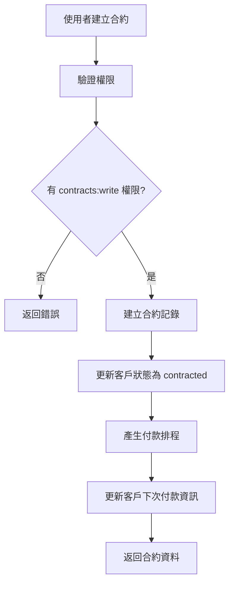
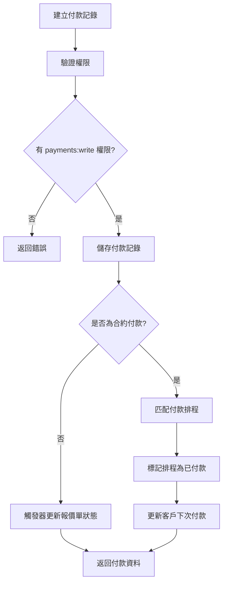

# 報價系統功能擴充 - 實施藍圖

## 📋 專案概述

本文檔說明如何實施以下新功能：

1. **公司設定頁面** - Logo、銀行帳戶、存摺影本上傳
2. **客戶合約管理** - 合約狀態、付款排程、到期日追蹤
3. **產品成本管理** - 成本欄位及權限控管
4. **角色權限系統 (RBAC)** - 5 個角色階層與細緻權限
5. **使用者介面** - 個人資料、登入帳號顯示
6. **收款追蹤頁面** - 已收款/未收款、逾期提醒

---

## 🎯 階段規劃

### **第一階段：資料庫與權限基礎** (預計 2-3 天)

#### 1.1 資料庫遷移
```bash
# 執行資料庫遷移
psql $ZEABUR_POSTGRES_URL -f migrations/001_rbac_and_new_features.sql
```

**包含內容：**
- ✅ 9 個新資料表
- ✅ 6 個資料表欄位更新
- ✅ 8 個自動化觸發器 (Triggers)
- ✅ 3 個實用視圖 (Views)

**新增資料表：**
1. `roles` - 角色定義
2. `permissions` - 權限定義
3. `role_permissions` - 角色權限映射
4. `user_roles` - 使用者角色分配
5. `user_profiles` - 使用者個人資料
6. `company_settings` - 公司設定
7. `customer_contracts` - 客戶合約
8. `payments` - 收款記錄
9. `payment_schedules` - 付款排程
10. `audit_logs` - 審計日誌

#### 1.2 Supabase Storage 設定

建立檔案儲存桶 (Buckets)：

```typescript
// 在 Supabase Dashboard 中建立：
1. company-files (公司檔案：Logo、簽章、存摺)
2. contract-files (合約檔案：PDF)
3. payment-receipts (付款收據)

// RLS 政策範例
CREATE POLICY "Users can view their own company files"
ON storage.objects FOR SELECT
USING (bucket_id = 'company-files' AND auth.uid() = owner);

CREATE POLICY "Users can upload their own company files"
ON storage.objects FOR INSERT
WITH CHECK (bucket_id = 'company-files' AND auth.uid() = owner);
```

#### 1.3 環境變數更新

`/.env.local`:
```bash
# 現有變數
NEXT_PUBLIC_SUPABASE_URL=...
NEXT_PUBLIC_SUPABASE_ANON_KEY=...
ZEABUR_POSTGRES_URL=...

# 新增 (如需要)
SUPABASE_SERVICE_ROLE_KEY=... # 用於伺服器端檔案上傳
```

---

### **第二階段：權限中介層與 API** (預計 3-4 天)

#### 2.1 建立權限檢查中介層

`/lib/middleware/auth-rbac.ts`:
```typescript
import { createServerClient } from '@/lib/supabase/server';
import { getUserPermissions, hasPermission } from '@/lib/services/rbac';
import { NextResponse } from 'next/server';

export async function requireAuth(request: Request) {
  const supabase = await createServerClient();
  const { data: { user }, error } = await supabase.auth.getUser();

  if (error || !user) {
    return NextResponse.json({ error: 'Unauthorized' }, { status: 401 });
  }

  return user;
}

export async function requirePermission(
  userId: string,
  resource: string,
  action: string
) {
  const hasAccess = await hasPermission(userId, resource, action);

  if (!hasAccess) {
    throw new Error(`Insufficient permissions: ${resource}:${action}`);
  }
}
```

#### 2.2 API 路由建立清單

**RBAC APIs** (`/app/api/rbac/...`):
- `POST /api/rbac/assign-role` - 分配角色
- `DELETE /api/rbac/remove-role` - 移除角色
- `GET /api/rbac/users` - 取得所有使用者
- `GET /api/rbac/users/[id]` - 取得單一使用者
- `PUT /api/rbac/users/[id]` - 更新使用者資料
- `POST /api/rbac/users/[id]/deactivate` - 停用使用者

**公司設定 APIs** (`/app/api/company-settings/...`):
- `GET /api/company-settings` - 取得公司設定
- `POST /api/company-settings` - 建立公司設定
- `PUT /api/company-settings` - 更新公司設定
- `POST /api/company-settings/upload-logo` - 上傳 Logo
- `POST /api/company-settings/upload-signature` - 上傳簽章
- `POST /api/company-settings/upload-passbook` - 上傳存摺

**合約 APIs** (`/app/api/contracts/...`):
- `GET /api/contracts` - 取得合約列表
- `GET /api/contracts/[id]` - 取得單一合約
- `POST /api/contracts` - 建立合約
- `PUT /api/contracts/[id]` - 更新合約
- `DELETE /api/contracts/[id]` - 刪除合約
- `POST /api/contracts/[id]/upload-file` - 上傳合約檔案
- `GET /api/contracts/[id]/schedules` - 取得付款排程

**付款 APIs** (`/app/api/payments/...`):
- `GET /api/payments` - 取得付款記錄
- `GET /api/payments/[id]` - 取得單一付款
- `POST /api/payments` - 建立付款記錄
- `PUT /api/payments/[id]` - 更新付款
- `DELETE /api/payments/[id]` - 刪除付款
- `POST /api/payments/[id]/upload-receipt` - 上傳收據
- `GET /api/payments/summary` - 取得付款摘要
- `GET /api/payments/overdue` - 取得逾期付款
- `GET /api/payments/upcoming` - 取得即將到期付款

**產品 APIs 更新** (`/app/api/products/...`):
- 更新 `GET /api/products` - 根據權限過濾 `cost_price` 欄位
- 更新 `GET /api/products/[id]` - 同上
- 更新 `POST /api/products` - 新增 `cost_price` 欄位
- 更新 `PUT /api/products/[id]` - 同上

#### 2.3 API 路由範例

`/app/api/company-settings/route.ts`:
```typescript
import { NextRequest, NextResponse } from 'next/server';
import { createServerClient } from '@/lib/supabase/server';
import {
  getCompanySettings,
  createCompanySettings,
  updateCompanySettings,
} from '@/lib/services/company';

export async function GET(request: NextRequest) {
  try {
    const supabase = await createServerClient();
    const { data: { user }, error } = await supabase.auth.getUser();

    if (error || !user) {
      return NextResponse.json({ error: 'Unauthorized' }, { status: 401 });
    }

    const settings = await getCompanySettings(user.id);

    if (!settings) {
      return NextResponse.json({ error: 'Settings not found' }, { status: 404 });
    }

    return NextResponse.json(settings);
  } catch (error: any) {
    return NextResponse.json({ error: error.message }, { status: 500 });
  }
}

export async function POST(request: NextRequest) {
  try {
    const supabase = await createServerClient();
    const { data: { user }, error } = await supabase.auth.getUser();

    if (error || !user) {
      return NextResponse.json({ error: 'Unauthorized' }, { status: 401 });
    }

    const body = await request.json();
    const settings = await createCompanySettings(user.id, body);

    return NextResponse.json(settings, { status: 201 });
  } catch (error: any) {
    return NextResponse.json({ error: error.message }, { status: 500 });
  }
}

export async function PUT(request: NextRequest) {
  try {
    const supabase = await createServerClient();
    const { data: { user }, error } = await supabase.auth.getUser();

    if (error || !user) {
      return NextResponse.json({ error: 'Unauthorized' }, { status: 401 });
    }

    const body = await request.json();
    const settings = await updateCompanySettings(user.id, body);

    return NextResponse.json(settings);
  } catch (error: any) {
    return NextResponse.json({ error: error.message }, { status: 500 });
  }
}
```

---

### **第三階段：React 元件開發** (預計 5-6 天)

#### 3.1 公司設定頁面

**元件結構：**
```
app/[locale]/settings/
├── page.tsx              # 主設定頁面
└── CompanySettingsForm.tsx  # 設定表單元件

components/settings/
├── FileUploadField.tsx   # 檔案上傳元件
├── LogoPreview.tsx       # Logo 預覽
└── BankInfoForm.tsx      # 銀行資訊表單
```

**關鍵功能：**
- ✅ 雙語輸入 (zh/en)
- ✅ 檔案上傳預覽
- ✅ 即時驗證
- ✅ 自動儲存

#### 3.2 使用者管理頁面

**元件結構：**
```
app/[locale]/users/
├── page.tsx              # 使用者列表
├── [id]/
│   └── page.tsx          # 使用者詳情/編輯
└── UserManagementTable.tsx

components/users/
├── RoleAssignmentModal.tsx  # 角色分配彈窗
├── UserProfileForm.tsx      # 個人資料表單
└── PermissionBadge.tsx      # 權限標籤
```

#### 3.3 合約管理頁面

**元件結構：**
```
app/[locale]/contracts/
├── page.tsx              # 合約列表
├── new/
│   └── page.tsx          # 新增合約
├── [id]/
│   └── page.tsx          # 合約詳情
├── ContractList.tsx
├── ContractForm.tsx
└── PaymentScheduleTable.tsx
```

#### 3.4 收款頁面

**元件結構：**
```
app/[locale]/payments/
├── page.tsx              # 收款總覽
├── received/
│   └── page.tsx          # 已收款列表
├── pending/
│   └── page.tsx          # 未收款列表
├── PaymentForm.tsx
├── PaymentList.tsx
├── OverdueAlerts.tsx
└── PaymentSummaryCards.tsx
```

#### 3.5 產品列表更新

更新 `/app/[locale]/products/ProductList.tsx`:
```typescript
import { canAccessProductCost } from '@/lib/services/rbac';

// 在元件中
const [canSeeCost, setCanSeeCost] = useState(false);

useEffect(() => {
  async function checkPermissions() {
    const hasAccess = await canAccessProductCost(user.id);
    setCanSeeCost(hasAccess);
  }
  checkPermissions();
}, [user]);

// 在表格中
{canSeeCost && (
  <td>
    <div className="text-sm">
      <div>成本: {product.cost_price} {product.cost_currency}</div>
      {product.profit_margin && (
        <div className="text-green-600">
          利潤率: {product.profit_margin.toFixed(1)}%
        </div>
      )}
    </div>
  </td>
)}
```

#### 3.6 導覽列更新

更新 `/components/Navbar.tsx`:
```typescript
import { getUserProfile } from '@/lib/services/rbac';

export default function Navbar() {
  const [userProfile, setUserProfile] = useState(null);

  // 右上角顯示使用者資訊
  return (
    <div className="flex items-center gap-4">
      <Link href="/settings/profile">
        {userProfile?.avatar_url ? (
          
        ) : (
          <div className="w-8 h-8 rounded-full bg-blue-500 flex items-center justify-center text-white">
            {userProfile?.display_name?.[0] || 'U'}
          </div>
        )}
      </Link>
      <div className="text-sm">
        <div className="font-medium">{userProfile?.display_name}</div>
        <div className="text-gray-500">{roleName}</div>
      </div>
    </div>
  );
}
```

---

### **第四階段：國際化 (i18n)** (預計 1-2 天)

#### 4.1 新增翻譯

`/messages/zh.json`:
```json
{
  "settings": {
    "title": "公司設定",
    "company_info": "公司資訊",
    "bank_info": "銀行資訊",
    "upload_logo": "上傳 Logo",
    "upload_signature": "上傳簽章",
    "upload_passbook": "上傳存摺影本"
  },
  "users": {
    "title": "使用者管理",
    "assign_role": "分配角色",
    "deactivate": "停用",
    "activate": "啟用"
  },
  "contracts": {
    "title": "合約管理",
    "contract_number": "合約編號",
    "payment_terms": {
      "quarterly": "季繳",
      "semi_annual": "半年繳",
      "annual": "年繳"
    }
  },
  "payments": {
    "title": "收款管理",
    "received": "已收款",
    "pending": "未收款",
    "overdue": "逾期",
    "payment_type": {
      "deposit": "頭款",
      "installment": "分期款",
      "final": "尾款",
      "full": "全額"
    }
  },
  "roles": {
    "super_admin": "總管理員",
    "company_owner": "公司負責人",
    "sales_manager": "業務主管",
    "salesperson": "業務人員",
    "accountant": "會計"
  }
}
```

`/messages/en.json`:
```json
{
  "settings": {
    "title": "Company Settings",
    "company_info": "Company Information",
    "bank_info": "Bank Information",
    "upload_logo": "Upload Logo",
    "upload_signature": "Upload Signature",
    "upload_passbook": "Upload Passbook"
  },
  "users": {
    "title": "User Management",
    "assign_role": "Assign Role",
    "deactivate": "Deactivate",
    "activate": "Activate"
  },
  "contracts": {
    "title": "Contract Management",
    "contract_number": "Contract Number",
    "payment_terms": {
      "quarterly": "Quarterly",
      "semi_annual": "Semi-Annual",
      "annual": "Annual"
    }
  },
  "payments": {
    "title": "Payment Management",
    "received": "Received",
    "pending": "Pending",
    "overdue": "Overdue",
    "payment_type": {
      "deposit": "Deposit",
      "installment": "Installment",
      "final": "Final",
      "full": "Full Payment"
    }
  },
  "roles": {
    "super_admin": "Super Admin",
    "company_owner": "Company Owner",
    "sales_manager": "Sales Manager",
    "salesperson": "Salesperson",
    "accountant": "Accountant"
  }
}
```

---

### **第五階段：測試與部署** (預計 2-3 天)

#### 5.1 單元測試

建立測試檔案：
```bash
lib/services/__tests__/
├── rbac.test.ts
├── company.test.ts
├── contracts.test.ts
└── payments.test.ts
```

#### 5.2 整合測試

測試場景：
1. ✅ 使用者註冊後自動建立 profile 和分配角色
2. ✅ 不同角色的權限檢查
3. ✅ 合約建立後自動產生付款排程
4. ✅ 付款記錄後自動更新報價單狀態
5. ✅ 檔案上傳與刪除
6. ✅ 逾期付款自動標記

#### 5.3 部署檢查清單

- [ ] 資料庫遷移已執行
- [ ] Supabase Storage buckets 已建立
- [ ] RLS 政策已設定
- [ ] 環境變數已設定
- [ ] 所有 API 路由正常運作
- [ ] 檔案上傳功能測試通過
- [ ] 權限系統測試通過
- [ ] i18n 翻譯完整
- [ ] 效能測試通過

---

## 📊 資料流程圖

### 合約建立流程



### 付款記錄流程



---

## 🔐 安全性考量

### 1. 權限檢查

所有敏感操作必須先檢查權限：
```typescript
// ❌ 錯誤：直接操作資料庫
await pool.query('UPDATE products SET cost_price = $1', [cost]);

// ✅ 正確：先檢查權限
const canEdit = await hasPermission(userId, 'products', 'write');
if (!canEdit) throw new Error('Insufficient permissions');
await pool.query('UPDATE products SET cost_price = $1', [cost]);
```

### 2. 檔案上傳安全

```typescript
// 檔案類型白名單
const ALLOWED_TYPES = {
  logo: ['image/png', 'image/jpeg', 'image/svg+xml'],
  contract: ['application/pdf'],
  receipt: ['image/png', 'image/jpeg', 'application/pdf'],
};

// 檔案大小限制
const MAX_FILE_SIZE = {
  logo: 2 * 1024 * 1024, // 2MB
  contract: 10 * 1024 * 1024, // 10MB
  receipt: 5 * 1024 * 1024, // 5MB
};
```

### 3. SQL Injection 防護

所有查詢使用參數化：
```typescript
// ❌ 危險
const result = await pool.query(`SELECT * FROM users WHERE email = '${email}'`);

// ✅ 安全
const result = await pool.query('SELECT * FROM users WHERE email = $1', [email]);
```

---

## 🚀 快速開始

### 1. 執行資料庫遷移

```bash
# 連接到 Zeabur PostgreSQL
psql $ZEABUR_POSTGRES_URL

# 執行遷移
\i migrations/001_rbac_and_new_features.sql

# 驗證資料表
\dt

# 檢查視圖
\dv
```

### 2. 設定初始管理員

```sql
-- 假設您的 user_id 是 'xxx-xxx-xxx'
INSERT INTO user_profiles (user_id, full_name, display_name)
VALUES ('YOUR_USER_ID', '您的名字', '顯示名稱');

INSERT INTO user_roles (user_id, role_id)
SELECT 'YOUR_USER_ID', id FROM roles WHERE name = 'super_admin';
```

### 3. 本地開發測試

```bash
# 安裝依賴（如有新增）
npm install

# 啟動開發伺服器
npm run dev

# 開啟瀏覽器
# http://localhost:3000/zh/settings
```

---

## 📞 支援與問題

### 常見問題

**Q: 如何為現有使用者分配角色？**
```sql
INSERT INTO user_roles (user_id, role_id, assigned_by)
SELECT 'TARGET_USER_ID', id, 'YOUR_ADMIN_ID'
FROM roles WHERE name = 'salesperson';
```

**Q: 如何重置付款排程？**
```sql
DELETE FROM payment_schedules WHERE contract_id = 'CONTRACT_ID';
-- 然後重新建立合約或呼叫 generatePaymentSchedule()
```

**Q: 如何備份資料庫？**
```bash
pg_dump $ZEABUR_POSTGRES_URL > backup_$(date +%Y%m%d).sql
```

---

## 📝 變更記錄

### 2025-10-18
- ✅ 建立資料庫架構
- ✅ 建立 TypeScript 類型
- ✅ 建立服務函式
- ✅ 建立實施藍圖文件

### 待辦事項
- [ ] 建立 API 路由
- [ ] 建立 React 元件
- [ ] 新增國際化翻譯
- [ ] 撰寫測試
- [ ] 部署至生產環境

---

## 🎉 結語

本實施藍圖提供了完整的步驟來擴充您的報價系統。按照階段逐步實施，可以確保系統穩定且功能完整。

如有任何問題，請參考：
- 資料庫架構：`migrations/001_rbac_and_new_features.sql`
- 類型定義：`types/rbac.types.ts`, `types/extended.types.ts`
- 服務函式：`lib/services/*.ts`

祝您實施順利！🚀
