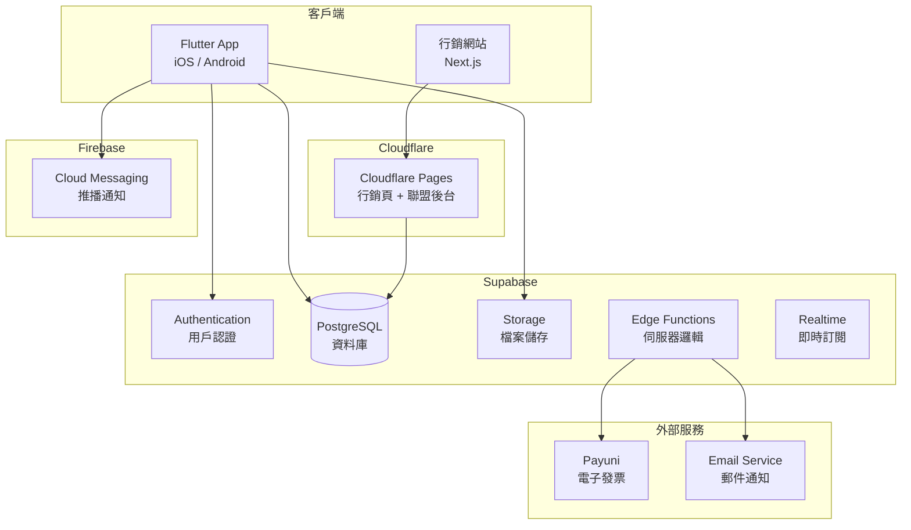
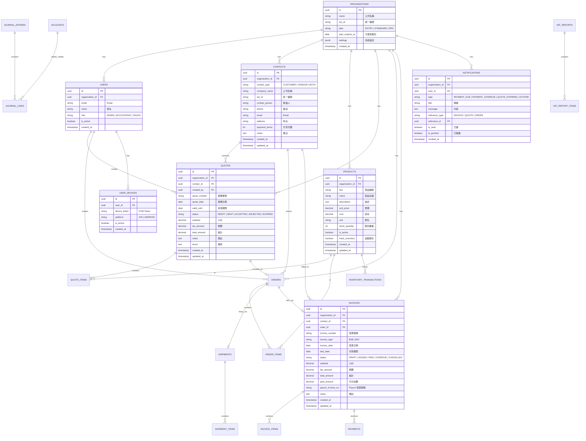
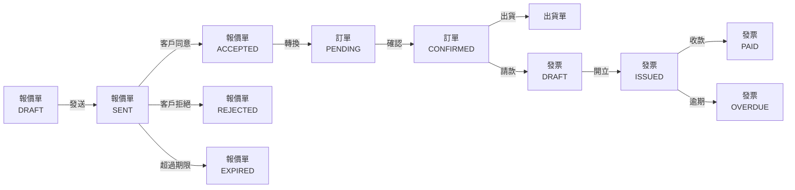

# 記帳通 - 軟體設計規格書 (SDD)

> **版本**：1.1  
> **建立日期**：2026-01-09  
> **更新日期**：2026-01-09  
> **專案代號**：Quote24 (記帳通)  
> **網址**：https://quote24.cc

---

## 1. 系統概述

### 1.1 專案目標

建立一套專為台灣中小企業設計的雲端記帳與報稅整合系統，讓年營收 3,000 萬以下的微型企業能夠自主完成記帳、報價、財務報表產出及稅務申報，不再依賴外部記帳士或會計事務所。

### 1.2 目標客群

| 特徵 | 描述 |
|------|------|
| **企業規模** | 年營收 NT$3,000 萬以下 |
| **員工人數** | 10 人以下的微型企業 |
| **現況痛點** | 使用 Excel 記帳、每月花 NT$2,000-5,000 請記帳士 |
| **核心需求** | 想省錢自己處理，但不會報稅 |

### 1.3 產品價值主張

> **「記帳 + 報稅，一站搞定」**  
> 不只是記帳軟體，更是你的雲端會計部門

| 傳統做法 | 使用記帳通 |
|---------|-----------|
| 記帳士月費 NT$2,000-5,000 | Entry 方案 NT$199/月 |
| 會計事務所年費 NT$60,000+ | Pro 方案 NT$2,499/月 |
| Excel 記帳 + 手動報稅 | 自動產出申報檔案 |

### 1.4 系統範圍

| 模組 | 功能描述 | 方案限制 |
|------|---------|---------|
| **銷售報價** | 報價單 → 訂單 → 出貨單 → 發票 完整流程 | 全方案 |
| **客戶管理** | 客戶/廠商資料維護、聯絡人管理 | 全方案 |
| **財務報表** | 資產負債表、損益表、現金流量表、應收應付明細 | 全方案 |
| **進銷存** | 庫存管理、進銷存報表 | 全方案 |
| **通知提醒** | App 推播、系統通知、Email 通知 | 全方案 |
| **電子發票** | Payuni 串接，B2B/B2C 發票開立 | Standard+ |
| **營業稅申報** | 401 申報 Media 檔 + PDF 預覽 | Standard+ |
| **營所稅計算** | 擴大書審試算 + 申報書表 | Pro |

---

## 2. 商業模式與定價

### 2.1 訂閱方案

| 方案 | 月費 | 目標用戶 | 核心價值 |
|------|-----:|---------|---------|
| **Entry** | NT$199 | 個人工作室、剛創業 | 輕量記帳入門 |
| **Standard** | NT$899 | 小型公司、有報稅需求 | 取代記帳士 |
| **Pro** | NT$2,499 | 成長型企業、完整需求 | 取代會計事務所 |

### 2.2 功能矩陣

| 功能 | Entry | Standard | Pro |
|------|:-----:|:--------:|:---:|
| 📝 銷售報價系統（無限） | ✅ | ✅ | ✅ |
| 📊 財務報表 | ✅ | ✅ | ✅ |
| 👥 客戶/廠商資料（無限） | ✅ | ✅ | ✅ |
| 📦 進銷存管理 | ✅ | ✅ | ✅ |
| 📁 檔案附件上傳 | ✅ | ✅ | ✅ |
| 🔄 資料匯入匯出 | ✅ | ✅ | ✅ |
| 🔔 收款提醒（App 推播） | ✅ | ✅ | ✅ |
| 📧 Email 通知 | ✅ | ✅ | ✅ |
| 👤 使用者帳號 | 1 人 | 3 人 | 無限 |
| 🔐 使用者權限管理 | 僅管理員 | 管理員/會計/業務 | 管理員/會計/業務 |
| 🔗 電子發票串接 (Payuni) | ❌ | ✅ | ✅ |
| 🧾 營業稅 401 申報 | ❌ | ✅ | ✅ |
| 💰 營所稅計算（擴大書審） | ❌ | ❌ | ✅ |
| 💾 資料保存期限 | 1 年 | 3 年 | 永久 |

### 2.3 成本與利潤分析

| 項目 | 金額 |
|------|-----:|
| 每月固定成本 | NT$1,000 |
| Entry 利潤 | NT$199 - 分攤成本 ≈ NT$150+ |
| Standard 利潤 | NT$899 - 分攤成本 ≈ NT$600+ |
| Pro 利潤 | NT$2,499 - 分攤成本 ≈ NT$1,800+ |
| 損益平衡點 | 約 6 個 Entry 客戶 |

### 2.4 金流與聯盟行銷

> 金流串接與聯盟行銷分潤系統參考 **affiliate 專案**，不在本 SDD 範圍內。

---

## 3. 技術架構

### 3.1 架構圖



### 3.2 技術規格

| 層級 | 技術 | 版本/規格 | 說明 |
|------|------|----------|------|
| **主應用程式** | Flutter | 3.x | iOS + Android 跨平台 App |
| **行銷網站** | Next.js | 14+ (App Router) | SEO 著陸頁、聯盟行銷後台 |
| **網站部署** | Cloudflare Pages | - | 全球 CDN |
| **後端服務** | Supabase | - | BaaS 平台 |
| **資料庫** | PostgreSQL | 15+ | Supabase 託管 |
| **認證** | Supabase Auth | - | JWT + Row Level Security |
| **檔案儲存** | Supabase Storage | - | S3 相容 |
| **推播通知** | Firebase Cloud Messaging | - | iOS/Android 推播（免費） |
| **狀態管理** | Riverpod / Bloc | - | Flutter 狀態管理 |
| **本地儲存** | Hive / SharedPreferences | - | App 本地快取 |

### 3.3 Flutter 專案結構

```
/quote24_app/
├── lib/
│   ├── main.dart                    # 應用程式入口
│   ├── app/
│   │   ├── app.dart                 # App 根元件
│   │   ├── routes.dart              # 路由設定
│   │   └── theme.dart               # 主題設定
│   ├── core/
│   │   ├── config/                  # 環境設定
│   │   ├── constants/               # 常數定義
│   │   ├── exceptions/              # 例外處理
│   │   ├── network/                 # 網路層
│   │   │   ├── api_client.dart
│   │   │   └── supabase_client.dart
│   │   └── utils/                   # 工具函式
│   │       ├── formatters.dart      # 格式化（金額、日期）
│   │       └── validators.dart      # 驗證器
│   ├── features/
│   │   ├── auth/                    # 認證模組
│   │   │   ├── data/
│   │   │   │   ├── models/
│   │   │   │   └── repositories/
│   │   │   ├── domain/
│   │   │   │   ├── entities/
│   │   │   │   └── usecases/
│   │   │   └── presentation/
│   │   │       ├── screens/
│   │   │       ├── widgets/
│   │   │       └── providers/
│   │   ├── dashboard/               # 儀表板
│   │   ├── contacts/                # 客戶/廠商管理
│   │   ├── quotes/                  # 報價單
│   │   ├── orders/                  # 訂單
│   │   ├── shipments/               # 出貨單
│   │   ├── invoices/                # 發票
│   │   ├── inventory/               # 進銷存
│   │   ├── reports/                 # 財務報表
│   │   ├── tax/                     # 稅務申報
│   │   │   ├── vat/                 # 營業稅 401
│   │   │   └── income_tax/          # 營所稅
│   │   ├── notifications/           # 通知中心
│   │   └── settings/                # 系統設定
│   ├── shared/
│   │   ├── widgets/                 # 共用元件
│   │   │   ├── buttons/
│   │   │   ├── cards/
│   │   │   ├── dialogs/
│   │   │   ├── forms/
│   │   │   └── tables/
│   │   └── extensions/              # Dart 擴充
│   └── l10n/                        # 多語系（繁中為主）
├── assets/
│   ├── images/
│   ├── icons/
│   └── fonts/
├── test/
│   ├── unit/
│   ├── widget/
│   └── integration/
├── pubspec.yaml
└── README.md
```

### 3.4 行銷網站結構 (Next.js)

```
/quote24_web/
├── app/
│   ├── page.tsx                     # 首頁（產品介紹）
│   ├── pricing/
│   │   └── page.tsx                 # 定價頁面
│   ├── features/
│   │   └── page.tsx                 # 功能介紹
│   ├── blog/
│   │   ├── page.tsx                 # 部落格列表
│   │   └── [slug]/
│   │       └── page.tsx             # 文章內容
│   ├── download/
│   │   └── page.tsx                 # App 下載頁
│   ├── affiliate/                   # 聯盟行銷（參考 affiliate 專案）
│   │   └── ...
│   └── layout.tsx
├── components/
├── lib/
├── public/
└── package.json
```

### 3.5 開發規範

#### 3.5.1 Flutter 命名規範

| 類型 | 規範 | 範例 |
|------|------|------|
| 檔案名稱 | snake_case | `quote_form.dart`, `contact_repository.dart` |
| 類別名稱 | PascalCase | `QuoteForm`, `ContactRepository` |
| 變數/方法 | camelCase | `calculateTotal()`, `contactList` |
| 常數 | lowerCamelCase / UPPER_SNAKE_CASE | `defaultPadding`, `VAT_RATE` |
| 私有成員 | _camelCase | `_isLoading`, `_fetchData()` |

#### 3.5.2 資料庫命名規範

| 類型 | 規範 | 範例 |
|------|------|------|
| 資料表 | snake_case | `contacts`, `quote_items` |
| 欄位 | snake_case | `contact_type`, `created_at` |
| 外鍵 | {table}_id | `contact_id`, `quote_id` |
| 索引 | idx_{table}_{column} | `idx_quotes_contact_id` |

#### 3.5.3 Dart 資料模型範例

```dart
// lib/features/contacts/data/models/contact_model.dart

import 'package:freezed_annotation/freezed_annotation.dart';

part 'contact_model.freezed.dart';
part 'contact_model.g.dart';

enum ContactType {
  @JsonValue('CUSTOMER')
  customer,
  @JsonValue('VENDOR')
  vendor,
  @JsonValue('BOTH')
  both,
}

@freezed
class Contact with _$Contact {
  const factory Contact({
    required String id,
    required String organizationId,
    required ContactType contactType,
    required String companyName,
    String? taxId,
    String? contactPerson,
    String? phone,
    String? email,
    String? address,
    @Default(30) int paymentTerms,
    String? notes,
    required DateTime createdAt,
    required DateTime updatedAt,
  }) = _Contact;

  factory Contact.fromJson(Map<String, dynamic> json) =>
      _$ContactFromJson(json);
}

// lib/features/quotes/data/models/quote_model.dart

enum QuoteStatus {
  @JsonValue('DRAFT')
  draft,
  @JsonValue('SENT')
  sent,
  @JsonValue('ACCEPTED')
  accepted,
  @JsonValue('REJECTED')
  rejected,
  @JsonValue('EXPIRED')
  expired,
}

@freezed
class Quote with _$Quote {
  const factory Quote({
    required String id,
    required String organizationId,
    required String contactId,
    Contact? contact,
    required String quoteNumber,
    required DateTime quoteDate,
    required DateTime validUntil,
    @Default(QuoteStatus.draft) QuoteStatus status,
    @Default(0) double subtotal,
    @Default(0) double taxAmount,
    @Default(0) double totalAmount,
    String? notes,
    String? terms,
    @Default([]) List<QuoteItem> items,
    required DateTime createdAt,
    required DateTime updatedAt,
  }) = _Quote;

  factory Quote.fromJson(Map<String, dynamic> json) =>
      _$QuoteFromJson(json);
}

@freezed
class QuoteItem with _$QuoteItem {
  const factory QuoteItem({
    required String id,
    required String quoteId,
    String? productId,
    required String description,
    required double quantity,
    required double unitPrice,
    @Default(0.05) double taxRate,
    required double subtotal,
    @Default(0) int sortOrder,
  }) = _QuoteItem;

  factory QuoteItem.fromJson(Map<String, dynamic> json) =>
      _$QuoteItemFromJson(json);
}
```

---

## 4. 資料庫設計

### 4.1 實體關係圖 (ERD)



### 4.2 資料表詳細規格

#### 4.2.1 `organizations` - 組織/公司表

| 欄位名稱 | 資料型態 | 約束 | 說明 |
|---------|---------|------|------|
| `id` | UUID | PK, DEFAULT uuid_generate_v4() | 主鍵 |
| `name` | VARCHAR(100) | NOT NULL | 公司名稱 |
| `tax_id` | VARCHAR(8) | UNIQUE | 統一編號 |
| `plan` | VARCHAR(20) | NOT NULL, DEFAULT 'ENTRY' | 訂閱方案 |
| `plan_expires_at` | DATE | NULL | 方案到期日 |
| `settings` | JSONB | DEFAULT '{}' | 系統設定 |
| `created_at` | TIMESTAMPTZ | NOT NULL, DEFAULT NOW() | 建立時間 |
| `updated_at` | TIMESTAMPTZ | NOT NULL, DEFAULT NOW() | 更新時間 |

#### 4.2.2 `users` - 使用者表

| 欄位名稱 | 資料型態 | 約束 | 說明 |
|---------|---------|------|------|
| `id` | UUID | PK, FK → auth.users.id | 主鍵 (對應 Supabase Auth) |
| `organization_id` | UUID | FK → organizations.id | 所屬組織 |
| `email` | VARCHAR(255) | NOT NULL | Email |
| `name` | VARCHAR(100) | NOT NULL | 姓名 |
| `role` | VARCHAR(20) | NOT NULL, DEFAULT 'ADMIN' | 角色：ADMIN/ACCOUNTANT/SALES |
| `is_active` | BOOLEAN | NOT NULL, DEFAULT TRUE | 是否啟用 |
| `created_at` | TIMESTAMPTZ | NOT NULL, DEFAULT NOW() | 建立時間 |
| `updated_at` | TIMESTAMPTZ | NOT NULL, DEFAULT NOW() | 更新時間 |

#### 4.2.3 `user_devices` - 使用者裝置表（推播用）

| 欄位名稱 | 資料型態 | 約束 | 說明 |
|---------|---------|------|------|
| `id` | UUID | PK, DEFAULT uuid_generate_v4() | 主鍵 |
| `user_id` | UUID | FK → users.id, NOT NULL | 所屬使用者 |
| `device_token` | VARCHAR(255) | NOT NULL | FCM Token |
| `platform` | VARCHAR(10) | NOT NULL | 平台：IOS/ANDROID |
| `is_active` | BOOLEAN | NOT NULL, DEFAULT TRUE | 是否啟用 |
| `created_at` | TIMESTAMPTZ | NOT NULL, DEFAULT NOW() | 建立時間 |
| `updated_at` | TIMESTAMPTZ | NOT NULL, DEFAULT NOW() | 更新時間 |

#### 4.2.4 `notifications` - 通知表

| 欄位名稱 | 資料型態 | 約束 | 說明 |
|---------|---------|------|------|
| `id` | UUID | PK, DEFAULT uuid_generate_v4() | 主鍵 |
| `organization_id` | UUID | FK → organizations.id, NOT NULL | 所屬組織 |
| `user_id` | UUID | FK → users.id, NOT NULL | 接收者 |
| `type` | VARCHAR(30) | NOT NULL | 類型 |
| `title` | VARCHAR(100) | NOT NULL | 標題 |
| `message` | TEXT | NOT NULL | 內容 |
| `reference_type` | VARCHAR(20) | NULL | 關聯類型：INVOICE/QUOTE/ORDER |
| `reference_id` | UUID | NULL | 關聯 ID |
| `is_read` | BOOLEAN | NOT NULL, DEFAULT FALSE | 已讀 |
| `is_pushed` | BOOLEAN | NOT NULL, DEFAULT FALSE | 已推播 |
| `created_at` | TIMESTAMPTZ | NOT NULL, DEFAULT NOW() | 建立時間 |

**通知類型 (type)**:
- `PAYMENT_DUE` - 款項即將到期
- `PAYMENT_OVERDUE` - 款項已逾期
- `QUOTE_EXPIRING` - 報價單即將到期
- `QUOTE_ACCEPTED` - 報價單已被接受
- `ORDER_CONFIRMED` - 訂單已確認
- `SYSTEM` - 系統通知

---

## 5. API 設計規格

### 5.1 API 總覽

> Flutter App 直接透過 Supabase Client SDK 操作資料庫，大部分 CRUD 不需要額外 API。
> 以下列出需要 Edge Functions 處理的複雜業務邏輯。

| 模組 | HTTP Method | Endpoint | 說明 |
|------|-------------|----------|------|
| **報價單** ||||
| | POST | `/functions/v1/quotes/convert` | 報價單轉訂單 |
| | POST | `/functions/v1/quotes/send` | 發送報價單（Email） |
| **發票** ||||
| | POST | `/functions/v1/invoices/issue` | 開立電子發票 (Payuni) |
| | POST | `/functions/v1/invoices/void` | 作廢發票 |
| **稅務申報** ||||
| | POST | `/functions/v1/tax/vat/generate` | 產生 401 申報檔 |
| | GET | `/functions/v1/tax/vat/preview` | 預覽申報內容 |
| | POST | `/functions/v1/tax/income/calculate` | 營所稅試算 |
| **通知** ||||
| | POST | `/functions/v1/notifications/push` | 發送推播通知 |
| | POST | `/functions/v1/notifications/check-due` | 檢查到期款項（排程用） |
| **Webhook** ||||
| | POST | `/functions/v1/webhooks/payuni` | Payuni 回調 |

### 5.2 推播通知服務

```typescript
// supabase/functions/notifications/push/index.ts

import { createClient } from '@supabase/supabase-js';
import * as admin from 'firebase-admin';

interface PushNotificationRequest {
  userId: string;
  title: string;
  body: string;
  data?: Record<string, string>;
}

Deno.serve(async (req) => {
  const supabase = createClient(
    Deno.env.get('SUPABASE_URL')!,
    Deno.env.get('SUPABASE_SERVICE_ROLE_KEY')!
  );

  const { userId, title, body, data }: PushNotificationRequest = await req.json();

  // 取得使用者的所有裝置 Token
  const { data: devices, error } = await supabase
    .from('user_devices')
    .select('device_token, platform')
    .eq('user_id', userId)
    .eq('is_active', true);

  if (error || !devices?.length) {
    return new Response(
      JSON.stringify({ success: false, error: 'No devices found' }),
      { status: 404 }
    );
  }

  // 發送推播
  const tokens = devices.map(d => d.device_token);
  
  const message = {
    notification: { title, body },
    data: data || {},
    tokens,
  };

  try {
    const response = await admin.messaging().sendEachForMulticast(message);
    
    return new Response(
      JSON.stringify({ 
        success: true, 
        successCount: response.successCount,
        failureCount: response.failureCount 
      }),
      { status: 200 }
    );
  } catch (error) {
    return new Response(
      JSON.stringify({ success: false, error: error.message }),
      { status: 500 }
    );
  }
});
```

### 5.3 收款提醒排程檢查

```typescript
// supabase/functions/notifications/check-due/index.ts

import { createClient } from '@supabase/supabase-js';

Deno.serve(async (req) => {
  const supabase = createClient(
    Deno.env.get('SUPABASE_URL')!,
    Deno.env.get('SUPABASE_SERVICE_ROLE_KEY')!
  );

  const today = new Date().toISOString().split('T')[0];
  const threeDaysLater = new Date(Date.now() + 3 * 24 * 60 * 60 * 1000)
    .toISOString().split('T')[0];

  // 查詢即將到期的發票（3天內）
  const { data: dueSoon, error: dueError } = await supabase
    .from('invoices')
    .select(`
      id, invoice_number, total_amount, due_date,
      contact:contacts(company_name),
      organization:organizations(id)
    `)
    .eq('status', 'ISSUED')
    .gte('due_date', today)
    .lte('due_date', threeDaysLater);

  // 查詢已逾期的發票
  const { data: overdue, error: overdueError } = await supabase
    .from('invoices')
    .select(`
      id, invoice_number, total_amount, due_date,
      contact:contacts(company_name),
      organization:organizations(id)
    `)
    .eq('status', 'ISSUED')
    .lt('due_date', today);

  // 為每筆建立通知
  const notifications: any[] = [];

  for (const invoice of dueSoon || []) {
    const daysUntilDue = Math.ceil(
      (new Date(invoice.due_date).getTime() - Date.now()) / (1000 * 60 * 60 * 24)
    );
    
    notifications.push({
      organization_id: invoice.organization.id,
      type: 'PAYMENT_DUE',
      title: '款項即將到期',
      message: `${invoice.contact.company_name} 的發票 ${invoice.invoice_number}（NT$${invoice.total_amount.toLocaleString()}）將於 ${daysUntilDue} 天後到期`,
      reference_type: 'INVOICE',
      reference_id: invoice.id,
    });
  }

  for (const invoice of overdue || []) {
    // 更新發票狀態為逾期
    await supabase
      .from('invoices')
      .update({ status: 'OVERDUE' })
      .eq('id', invoice.id);

    const daysOverdue = Math.ceil(
      (Date.now() - new Date(invoice.due_date).getTime()) / (1000 * 60 * 60 * 24)
    );
    
    notifications.push({
      organization_id: invoice.organization.id,
      type: 'PAYMENT_OVERDUE',
      title: '款項已逾期',
      message: `${invoice.contact.company_name} 的發票 ${invoice.invoice_number}（NT$${invoice.total_amount.toLocaleString()}）已逾期 ${daysOverdue} 天`,
      reference_type: 'INVOICE',
      reference_id: invoice.id,
    });
  }

  // 批次寫入通知
  if (notifications.length > 0) {
    await supabase.from('notifications').insert(notifications);
  }

  return new Response(
    JSON.stringify({ 
      success: true, 
      dueSoonCount: dueSoon?.length || 0,
      overdueCount: overdue?.length || 0,
      notificationsCreated: notifications.length 
    }),
    { status: 200 }
  );
});
```

---

## 6. 業務邏輯規格

### 6.1 報價單轉換流程



### 6.2 通知觸發規則

| 觸發事件 | 通知類型 | 觸發時機 | 推播？ |
|---------|---------|---------|:------:|
| 發票即將到期 | `PAYMENT_DUE` | 到期前 3 天（每日排程檢查） | ✅ |
| 發票已逾期 | `PAYMENT_OVERDUE` | 超過到期日（每日排程檢查） | ✅ |
| 報價單即將到期 | `QUOTE_EXPIRING` | 有效期限前 3 天 | ✅ |
| 報價單被接受 | `QUOTE_ACCEPTED` | 狀態變更時 | ✅ |
| 訂單已確認 | `ORDER_CONFIRMED` | 狀態變更時 | ✅ |
| 收到付款 | `PAYMENT_RECEIVED` | 記錄付款時 | ✅ |

### 6.3 營業稅 401 申報檔產出

```dart
// lib/features/tax/vat/services/vat_media_generator.dart

class Vat401MediaGenerator {
  /// 產生 401 申報 Media 檔
  /// 格式：81 bytes 固定長度記錄
  String generate(VatReportData data) {
    final lines = <String>[];
    
    // 表頭記錄 (H)
    lines.add(_generateHeaderRecord(data));
    
    // 銷項明細 (S)
    for (final item in data.salesItems) {
      lines.add(_generateSalesRecord(item, data.taxId));
    }
    
    // 進項明細 (P)
    for (final item in data.purchaseItems) {
      lines.add(_generatePurchaseRecord(item, data.taxId));
    }
    
    // 表尾記錄 (T)
    lines.add(_generateTrailerRecord(data));
    
    return lines.join('\r\n');
  }

  String _generateHeaderRecord(VatReportData data) {
    // H + 統編(8) + 年度(3) + 期別(2) + 空白(67) = 81 bytes
    final year = (data.year - 1911).toString().padLeft(3, '0');
    final period = data.period.toString().padLeft(2, '0');
    return 'H${data.taxId}$year$period${' ' * 67}';
  }

  String _generateSalesRecord(SalesItem item, String sellerTaxId) {
    final yearMonth = _formatYearMonth(item.invoiceDate);
    final amount = item.salesAmount.round().toString().padLeft(12, '0');
    final tax = item.taxAmount.round().toString().padLeft(10, '0');
    
    return 'S31${item.buyerTaxId.padRight(8)}$yearMonth'
           '${item.invoiceNumber.padRight(10)}$amount${item.taxType}$tax'
           '${' ' * 23}';
  }

  String _formatYearMonth(DateTime date) {
    final year = date.year - 1911;
    final month = date.month.toString().padLeft(2, '0');
    return '$year$month';
  }
}
```

### 6.4 營所稅擴大書審計算

```dart
// lib/features/tax/income_tax/services/income_tax_calculator.dart

class IncomeTaxCalculator {
  /// 擴大書審純益率表
  static const Map<String, double> industryProfitRates = {
    '4510': 0.06, // 汽車零售業
    '4610': 0.06, // 商品批發經紀業
    '4641': 0.06, // 布疋及服飾品批發業
    '4711': 0.06, // 零售式量販業
    '4719': 0.06, // 其他綜合商品零售業
    '4721': 0.08, // 蔬果零售業
    '5610': 0.08, // 餐館業
    '5820': 0.10, // 軟體出版業
    '6201': 0.10, // 電腦程式設計業
    '6202': 0.10, // 電腦諮詢服務業
    '7010': 0.12, // 企業總管理機構
    '7020': 0.10, // 管理顧問業
  };

  /// 計算擴大書審營所稅
  /// 適用條件：年營收 NT$3,000 萬以下
  IncomeTaxResult calculate({
    required double revenue,
    required double nonOperatingIncome,
    required String industryCode,
  }) {
    // 取得該行業的擴大書審純益率
    final profitRate = industryProfitRates[industryCode] ?? 0.06;
    
    // 課稅所得額 = (營業收入 × 純益率) + 非營業收入
    final taxableIncome = (revenue * profitRate + nonOperatingIncome).round();
    
    // 營所稅率 20% (2018年起)
    // 課稅所得額 12萬以下免稅
    int taxAmount = 0;
    if (taxableIncome > 120000) {
      taxAmount = (taxableIncome * 0.20).round();
    }
    
    return IncomeTaxResult(
      year: DateTime.now().year - 1,
      revenue: revenue,
      nonOperatingIncome: nonOperatingIncome,
      industryCode: industryCode,
      profitRate: profitRate,
      taxableIncome: taxableIncome.toDouble(),
      taxAmount: taxAmount.toDouble(),
    );
  }
}

class IncomeTaxResult {
  final int year;
  final double revenue;
  final double nonOperatingIncome;
  final String industryCode;
  final double profitRate;
  final double taxableIncome;
  final double taxAmount;

  IncomeTaxResult({
    required this.year,
    required this.revenue,
    required this.nonOperatingIncome,
    required this.industryCode,
    required this.profitRate,
    required this.taxableIncome,
    required this.taxAmount,
  });
}
```

---

## 7. 頁面功能規格

### 7.1 App 頁面結構

```
📱 記帳通 App
├── 🔐 認證
│   ├── 登入
│   ├── 註冊
│   └── 忘記密碼
├── 🏠 儀表板（首頁）
│   ├── 本月營收摘要
│   ├── 待處理事項
│   ├── 應收帳款帳齡圖
│   └── 快速操作按鈕
├── 👥 客戶/廠商
│   ├── 列表
│   └── 新增/編輯
├── 📦 商品
│   ├── 列表
│   └── 新增/編輯
├── 📝 報價單
│   ├── 列表
│   ├── 新增/編輯
│   └── 詳情（含轉訂單）
├── 📋 訂單
│   ├── 列表
│   ├── 新增/編輯
│   └── 詳情（含出貨）
├── 🚚 出貨單
│   ├── 列表
│   └── 詳情
├── 🧾 發票
│   ├── 列表
│   ├── 新增/編輯
│   └── 詳情（含收款記錄）
├── 📊 財務報表
│   ├── 損益表
│   ├── 資產負債表
│   ├── 現金流量表
│   ├── 應收帳款帳齡
│   └── 應付帳款帳齡
├── 💰 稅務申報 [Standard+]
│   ├── 營業稅 401
│   │   ├── 期別選擇
│   │   ├── 資料預覽
│   │   └── 產出申報檔
│   └── 營所稅 [Pro]
│       ├── 資料輸入
│       └── 試算結果
├── 🔔 通知中心
│   └── 通知列表
└── ⚙️ 設定
    ├── 公司資料
    ├── 使用者管理 [多人方案]
    ├── 電子發票設定 [Standard+]
    ├── 通知設定
    └── 帳號與訂閱
```

### 7.2 儀表板設計

**功能**:
- 本月營收摘要卡片（營收、待收款、已收款）
- 待處理事項提醒（待確認訂單、逾期發票、即將到期報價）
- 應收帳款帳齡圓餅圖
- 近期收款記錄列表
- 快速操作按鈕（新增報價、新增發票）

### 7.3 通知中心設計

**功能**:
- 依時間排序的通知列表
- 未讀/已讀狀態標示
- 點擊通知跳轉至相關頁面
- 標記全部已讀
- 清除已讀通知

---

## 8. 開發階段規劃

### 8.1 Phase 1：核心基礎 (MVP)

**預計時程**: 6-8 週

**功能範圍**:
- [ ] Flutter 專案架構建置
- [ ] Supabase 專案設定
- [ ] 用戶認證（註冊、登入、忘記密碼）
- [ ] 組織/公司設定
- [ ] 客戶/廠商管理 CRUD
- [ ] 商品管理 CRUD
- [ ] 報價單完整流程
- [ ] 儀表板基礎版
- [ ] 基本財務報表（損益表）
- [ ] App 推播通知基礎架構

**交付物**:
- 可運作的 MVP 版本
- Entry 方案可開始收費

### 8.2 Phase 2：完整交易流程

**預計時程**: 4-5 週

**功能範圍**:
- [ ] 訂單管理
- [ ] 出貨單管理
- [ ] 發票管理（內部發票，非電子發票）
- [ ] 收款記錄
- [ ] 完整財務報表（資產負債表、現金流量表）
- [ ] 進銷存基礎功能
- [ ] 通知中心完整功能
- [ ] 收款提醒排程（App 推播）

### 8.3 Phase 3：營業稅申報

**預計時程**: 2-3 週

**功能範圍**:
- [ ] 401 申報資料彙整
- [ ] Media 申報檔產出
- [ ] PDF 預覽
- [ ] 申報記錄管理

**交付物**:
- Standard 方案可開始收費

### 8.4 Phase 4：電子發票串接

**預計時程**: 2-3 週

**功能範圍**:
- [ ] Payuni 帳號設定
- [ ] B2B 發票開立
- [ ] B2C 發票開立
- [ ] 發票作廢/折讓
- [ ] Webhook 回調處理

### 8.5 Phase 5：營所稅計算

**預計時程**: 2 週

**功能範圍**:
- [ ] 擴大書審純益率資料庫
- [ ] 稅額試算功能
- [ ] 申報書表產出

**交付物**:
- Pro 方案完整功能

### 8.6 Phase 6：行銷網站

**預計時程**: 2-3 週

**功能範圍**:
- [ ] Next.js 專案建置
- [ ] 產品介紹頁面
- [ ] 定價頁面
- [ ] 功能介紹頁面
- [ ] App 下載頁
- [ ] SEO 優化
- [ ] 聯盟行銷整合（參考 affiliate 專案）

---

## 9. 驗證計畫

### 9.1 自動化測試

**單元測試**:
- 稅額計算邏輯
- 報價單金額計算
- 401 Media 檔格式產出
- 通知觸發邏輯

**Widget 測試**:
- 表單驗證
- 列表顯示

**整合測試**:
- 報價單 → 訂單 → 發票 轉換流程
- Payuni API 串接
- FCM 推播

### 9.2 手動驗證項目

| 項目 | 驗證內容 |
|------|---------|
| 報價單流程 | 新增 → 發送 → 轉訂單 → 出貨 → 開發票 |
| 財務報表 | 數字正確性、報表格式 |
| 401 申報 | 申報檔格式、金額正確性 |
| 電子發票 | B2B/B2C 開立、作廢流程 |
| 推播通知 | iOS/Android 推播、排程觸發 |
| 權限控管 | 不同角色的存取限制 |

---

## 10. 附錄

### 10.1 名詞對照表

| 中文術語 | 英文對應 | 說明 |
|---------|---------|------|
| 報價單 | Quote | 向客戶提供的報價文件 |
| 訂單 | Order | 客戶確認的採購單 |
| 出貨單 | Shipment | 商品出貨記錄 |
| 發票 | Invoice | 請款憑證 |
| 統一編號 | Tax ID | 台灣營業人識別碼 (8碼) |
| 營業稅 | VAT | Value Added Tax (5%) |
| 營所稅 | Income Tax | 營利事業所得稅 (20%) |
| 擴大書審 | Expanded Audit | 簡化的營所稅申報方式 |
| 純益率 | Profit Rate | 擴大書審適用的行業純益率 |

### 10.2 營業稅申報期別

| 期別 | 申報月份範圍 | 申報截止日 |
|------|-------------|-----------|
| 第 1 期 | 1-2 月 | 3/15 |
| 第 2 期 | 3-4 月 | 5/15 |
| 第 3 期 | 5-6 月 | 7/15 |
| 第 4 期 | 7-8 月 | 9/15 |
| 第 5 期 | 9-10 月 | 11/15 |
| 第 6 期 | 11-12 月 | 隔年 1/15 |

### 10.3 使用者角色權限

| 功能 | 管理員 | 會計 | 業務 |
|------|:------:|:----:|:----:|
| 系統設定 | ✅ | ❌ | ❌ |
| 使用者管理 | ✅ | ❌ | ❌ |
| 客戶管理 | ✅ | ✅ | ✅ |
| 報價單 | ✅ | ✅ | ✅ |
| 訂單 | ✅ | ✅ | 👁️ |
| 發票 | ✅ | ✅ | 👁️ |
| 收款記錄 | ✅ | ✅ | ❌ |
| 財務報表 | ✅ | ✅ | ❌ |
| 稅務申報 | ✅ | ✅ | ❌ |
| 通知中心 | ✅ | ✅ | ✅ |

> 👁️ = 僅檢視權限

---

## 11. 版本歷程

| 版本 | 日期 | 變更說明 |
|------|------|---------|
| 1.0 | 2026-01-09 | 初版建立 |
| 1.1 | 2026-01-09 | 技術架構調整為 Flutter App + Next.js 行銷頁；移除 LINE 提醒，改用 App 推播；聯盟行銷參考 affiliate 專案 |
