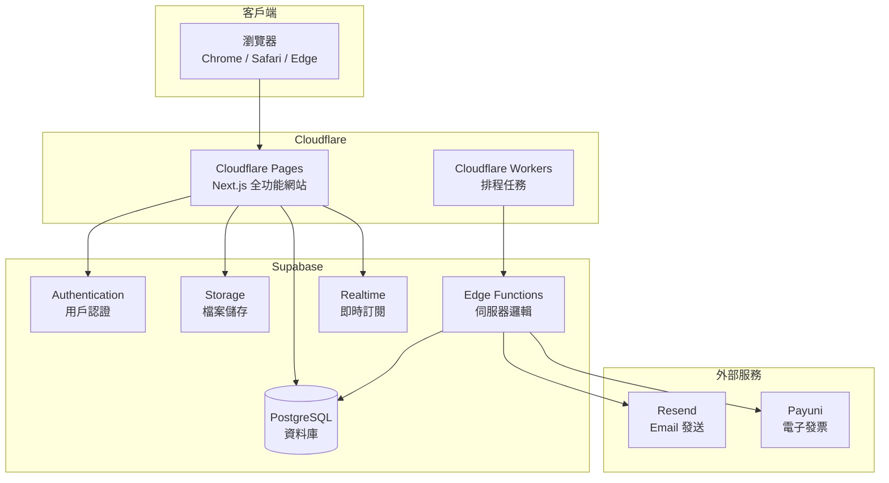
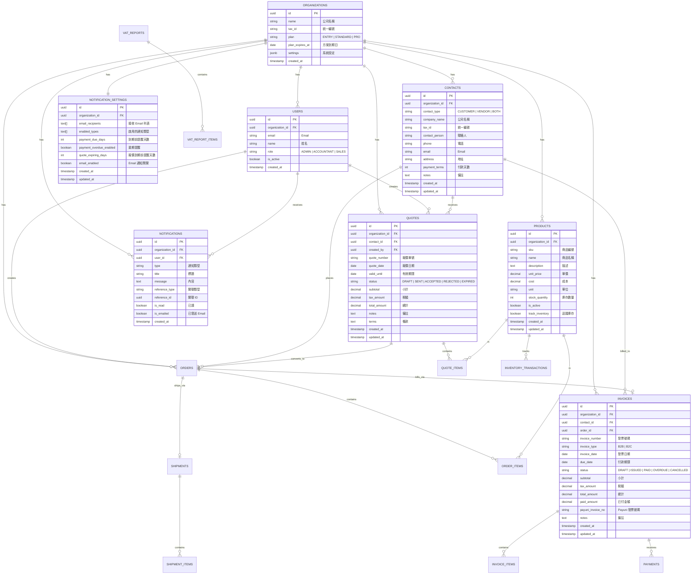
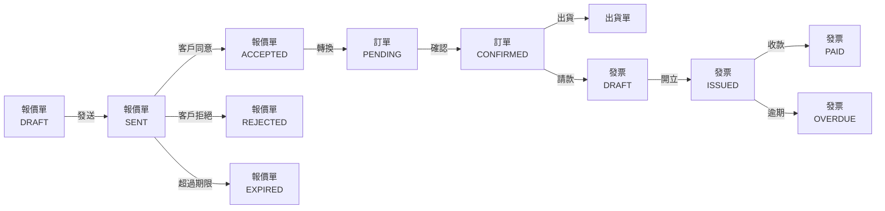

# 記帳通 - 軟體設計規格書 (SDD)

> **版本**：1.2  
> **建立日期**：2026-01-09  
> **更新日期**：2026-01-09  
> **專案代號**：Quote24 (記帳通)  
> **網址**：https://quote24.cc

---

## 1. 系統概述

### 1.1 專案目標

建立一套專為台灣中小企業設計的雲端記帳與報稅整合系統，讓年營收 3,000 萬以下的微型企業能夠自主完成記帳、報價、財務報表產出及稅務申報，不再依賴外部記帳士或會計事務所。

### 1.2 目標客群

| 特徵 | 描述 |
|------|------|
| **企業規模** | 年營收 NT$3,000 萬以下 |
| **員工人數** | 10 人以下的微型企業 |
| **現況痛點** | 使用 Excel 記帳、每月花 NT$2,000-5,000 請記帳士 |
| **核心需求** | 想省錢自己處理，但不會報稅 |

### 1.3 產品價值主張

> **「記帳 + 報稅，一站搞定」**  
> 不只是記帳軟體，更是你的雲端會計部門

| 傳統做法 | 使用記帳通 |
|---------|-----------|
| 記帳士月費 NT$2,000-5,000 | Entry 方案 NT$199/月 |
| 會計事務所年費 NT$60,000+ | Pro 方案 NT$2,499/月 |
| Excel 記帳 + 手動報稅 | 自動產出申報檔案 |

### 1.4 系統範圍

| 模組 | 功能描述 | 方案限制 |
|------|---------|---------|
| **銷售報價** | 報價單 → 訂單 → 出貨單 → 發票 完整流程 | 全方案 |
| **客戶管理** | 客戶/廠商資料維護、聯絡人管理 | 全方案 |
| **財務報表** | 資產負債表、損益表、現金流量表、應收應付明細 | 全方案 |
| **進銷存** | 庫存管理、進銷存報表 | 全方案 |
| **通知提醒** | Email 通知 + 網站內通知中心 | 全方案 |
| **電子發票** | Payuni 串接，B2B/B2C 發票開立 | Standard+ |
| **營業稅申報** | 401 申報 Media 檔 + PDF 預覽 | Standard+ |
| **營所稅計算** | 擴大書審試算 + 申報書表 | Pro |

---

## 2. 商業模式與定價

### 2.1 訂閱方案

| 方案 | 月費 | 目標用戶 | 核心價值 |
|------|-----:|---------|---------|
| **Entry** | NT$199 | 個人工作室、剛創業 | 輕量記帳入門 |
| **Standard** | NT$899 | 小型公司、有報稅需求 | 取代記帳士 |
| **Pro** | NT$2,499 | 成長型企業、完整需求 | 取代會計事務所 |

### 2.2 功能矩陣

| 功能 | Entry | Standard | Pro |
|------|:-----:|:--------:|:---:|
| 📝 銷售報價系統（無限） | ✅ | ✅ | ✅ |
| 📊 財務報表 | ✅ | ✅ | ✅ |
| 👥 客戶/廠商資料（無限） | ✅ | ✅ | ✅ |
| 📦 進銷存管理 | ✅ | ✅ | ✅ |
| 📁 檔案附件上傳 | ✅ | ✅ | ✅ |
| 🔄 資料匯入匯出 | ✅ | ✅ | ✅ |
| 🔔 網站內通知中心 | ✅ | ✅ | ✅ |
| 📧 Email 通知提醒 | ✅ | ✅ | ✅ |
| 👤 使用者帳號 | 1 人 | 3 人 | 無限 |
| 🔐 使用者權限管理 | 僅管理員 | 管理員/會計/業務 | 管理員/會計/業務 |
| 🔗 電子發票串接 (Payuni) | ❌ | ✅ | ✅ |
| 🧾 營業稅 401 申報 | ❌ | ✅ | ✅ |
| 💰 營所稅計算（擴大書審） | ❌ | ❌ | ✅ |
| 💾 資料保存期限 | 1 年 | 3 年 | 永久 |

### 2.3 成本與利潤分析

| 項目 | 金額 |
|------|-----:|
| Supabase (Free Tier) | NT$0 |
| Cloudflare Pages (Free) | NT$0 |
| Resend (3,000封/月免費) | NT$0 |
| 網域 (quote24.cc) | ~NT$500/年 |
| **每月固定成本** | **~NT$50** |
| Entry 利潤 | NT$199 - 分攤成本 ≈ NT$180+ |
| Standard 利潤 | NT$899 - 分攤成本 ≈ NT$850+ |
| Pro 利潤 | NT$2,499 - 分攤成本 ≈ NT$2,400+ |
| **損益平衡點** | **1 個 Entry 客戶即可** |

### 2.4 Email 成本估算

| 階段 | 客戶數 | 預估月發送量 | Resend 費用 |
|------|-------:|------------:|------------:|
| 初期 | 1-50 | ~500 封 | NT$0（免費額度內） |
| 成長期 | 50-200 | ~3,000 封 | NT$0（免費額度內） |
| 規模期 | 200+ | 3,000+ 封 | ~NT$600/月起 |

### 2.5 金流與聯盟行銷

> 金流串接與聯盟行銷分潤系統參考 **affiliate 專案**，不在本 SDD 範圍內。

---

## 3. 技術架構

### 3.1 架構圖



### 3.2 技術規格

| 層級 | 技術 | 版本/規格 | 說明 |
|------|------|----------|------|
| **前端框架** | Next.js | 14+ (App Router) | React 全端框架 |
| **UI 元件庫** | shadcn/ui | - | 基於 Radix UI + Tailwind |
| **CSS 框架** | Tailwind CSS | 3.x | 原子化 CSS |
| **部署平台** | Cloudflare Pages | - | 全球 CDN + Edge Runtime |
| **排程任務** | Cloudflare Workers | Cron Triggers | 定時檢查到期通知 |
| **後端服務** | Supabase | - | BaaS 平台 |
| **資料庫** | PostgreSQL | 15+ | Supabase 託管 |
| **認證** | Supabase Auth | - | JWT + Row Level Security |
| **檔案儲存** | Supabase Storage | - | S3 相容 |
| **Email 服務** | Resend | - | 3,000 封/月免費 |
| **狀態管理** | Zustand / React Query | - | 客戶端狀態管理 |

### 3.3 專案結構

```
/quote24/
├── app/                           # Next.js App Router
│   ├── (marketing)/              # 行銷頁面群組
│   │   ├── page.tsx              # 首頁（產品介紹）
│   │   ├── pricing/
│   │   │   └── page.tsx          # 定價頁面
│   │   ├── features/
│   │   │   └── page.tsx          # 功能介紹
│   │   └── blog/
│   │       ├── page.tsx          # 部落格列表
│   │       └── [slug]/
│   │           └── page.tsx      # 文章內容
│   ├── (auth)/                   # 認證頁面群組
│   │   ├── login/
│   │   │   └── page.tsx          # 登入
│   │   ├── register/
│   │   │   └── page.tsx          # 註冊
│   │   └── forgot-password/
│   │       └── page.tsx          # 忘記密碼
│   ├── (dashboard)/              # 應用程式主體（需登入）
│   │   ├── layout.tsx            # Dashboard 共用 Layout
│   │   ├── page.tsx              # 儀表板首頁
│   │   ├── contacts/
│   │   │   ├── page.tsx          # 客戶/廠商列表
│   │   │   ├── new/
│   │   │   │   └── page.tsx      # 新增
│   │   │   └── [id]/
│   │   │       └── page.tsx      # 編輯/詳情
│   │   ├── products/
│   │   │   ├── page.tsx          # 商品列表
│   │   │   ├── new/
│   │   │   │   └── page.tsx
│   │   │   └── [id]/
│   │   │       └── page.tsx
│   │   ├── quotes/
│   │   │   ├── page.tsx          # 報價單列表
│   │   │   ├── new/
│   │   │   │   └── page.tsx
│   │   │   └── [id]/
│   │   │       └── page.tsx
│   │   ├── orders/
│   │   │   ├── page.tsx          # 訂單列表
│   │   │   ├── new/
│   │   │   │   └── page.tsx
│   │   │   └── [id]/
│   │   │       └── page.tsx
│   │   ├── shipments/
│   │   │   ├── page.tsx          # 出貨單列表
│   │   │   └── [id]/
│   │   │       └── page.tsx
│   │   ├── invoices/
│   │   │   ├── page.tsx          # 發票列表
│   │   │   ├── new/
│   │   │   │   └── page.tsx
│   │   │   └── [id]/
│   │   │       └── page.tsx
│   │   ├── reports/
│   │   │   ├── page.tsx          # 報表總覽
│   │   │   ├── income-statement/
│   │   │   │   └── page.tsx      # 損益表
│   │   │   ├── balance-sheet/
│   │   │   │   └── page.tsx      # 資產負債表
│   │   │   ├── cash-flow/
│   │   │   │   └── page.tsx      # 現金流量表
│   │   │   └── aging/
│   │   │       └── page.tsx      # 帳齡分析
│   │   ├── tax/
│   │   │   ├── vat/
│   │   │   │   └── page.tsx      # 營業稅 401
│   │   │   └── income-tax/
│   │   │       └── page.tsx      # 營所稅
│   │   ├── notifications/
│   │   │   └── page.tsx          # 通知中心
│   │   └── settings/
│   │       ├── page.tsx          # 設定總覽
│   │       ├── company/
│   │       │   └── page.tsx      # 公司資料
│   │       ├── users/
│   │       │   └── page.tsx      # 使用者管理
│   │       ├── notifications/
│   │       │   └── page.tsx      # 通知設定
│   │       ├── invoice/
│   │       │   └── page.tsx      # 電子發票設定
│   │       └── subscription/
│   │           └── page.tsx      # 訂閱管理
│   ├── api/                      # API Routes
│   │   ├── webhooks/
│   │   │   └── payuni/
│   │   │       └── route.ts      # Payuni Webhook
│   │   └── cron/
│   │       └── check-due/
│   │           └── route.ts      # 到期檢查（供 CF Workers 呼叫）
│   ├── layout.tsx                # 根 Layout
│   └── globals.css               # 全域樣式
├── components/
│   ├── ui/                       # shadcn/ui 元件
│   ├── layout/
│   │   ├── header.tsx
│   │   ├── sidebar.tsx
│   │   ├── notification-bell.tsx # 通知鈴鐺
│   │   └── footer.tsx
│   ├── forms/
│   │   ├── contact-form.tsx
│   │   ├── product-form.tsx
│   │   ├── quote-form.tsx
│   │   ├── order-form.tsx
│   │   └── invoice-form.tsx
│   ├── tables/
│   │   ├── contacts-table.tsx
│   │   ├── quotes-table.tsx
│   │   └── data-table.tsx        # 通用資料表格
│   └── charts/
│       ├── revenue-chart.tsx
│       └── aging-chart.tsx
├── lib/
│   ├── supabase/
│   │   ├── client.ts             # 瀏覽器端 Client
│   │   ├── server.ts             # 伺服器端 Client
│   │   └── middleware.ts         # Auth Middleware
│   ├── resend/
│   │   └── client.ts             # Resend Client
│   ├── utils/
│   │   ├── formatters.ts         # 格式化工具
│   │   ├── validators.ts         # 驗證工具
│   │   └── tax-calculator.ts     # 稅額計算
│   └── constants/
│       ├── notification-types.ts
│       └── industry-codes.ts     # 行業代碼與純益率
├── hooks/
│   ├── use-notifications.ts      # 通知相關 Hook
│   ├── use-realtime.ts           # Supabase Realtime Hook
│   └── use-auth.ts               # 認證相關 Hook
├── types/
│   ├── database.ts               # Supabase 自動產生的型別
│   ├── contact.ts
│   ├── quote.ts
│   ├── order.ts
│   └── notification.ts
├── supabase/
│   ├── migrations/               # 資料庫遷移
│   ├── functions/                # Edge Functions
│   │   ├── send-email/
│   │   │   └── index.ts
│   │   ├── check-due-payments/
│   │   │   └── index.ts
│   │   ├── issue-invoice/
│   │   │   └── index.ts
│   │   └── generate-vat-report/
│   │       └── index.ts
│   └── seed.sql                  # 種子資料
├── workers/                      # Cloudflare Workers
│   └── cron-trigger/
│       ├── index.ts              # 排程觸發器
│       └── wrangler.toml
├── public/
│   └── images/
├── package.json
├── tailwind.config.ts
├── tsconfig.json
└── README.md
```

### 3.4 開發規範

#### 3.4.1 命名規範

| 類型 | 規範 | 範例 |
|------|------|------|
| 檔案名稱 | kebab-case | `contact-form.tsx`, `use-notifications.ts` |
| React 元件 | PascalCase | `ContactForm`, `NotificationBell` |
| 函式/變數 | camelCase | `calculateTotal()`, `contactList` |
| 常數 | UPPER_SNAKE_CASE | `VAT_RATE`, `NOTIFICATION_TYPES` |
| 資料表 | snake_case | `contacts`, `quote_items` |
| 資料表欄位 | snake_case | `contact_type`, `created_at` |

#### 3.4.2 TypeScript 型別範例

```typescript
// types/contact.ts

export type ContactType = 'CUSTOMER' | 'VENDOR' | 'BOTH';

export interface Contact {
  id: string;
  organization_id: string;
  contact_type: ContactType;
  company_name: string;
  tax_id?: string;
  contact_person?: string;
  phone?: string;
  email?: string;
  address?: string;
  payment_terms: number;
  notes?: string;
  created_at: string;
  updated_at: string;
}

export interface ContactFormData {
  contact_type: ContactType;
  company_name: string;
  tax_id?: string;
  contact_person?: string;
  phone?: string;
  email?: string;
  address?: string;
  payment_terms?: number;
  notes?: string;
}

// types/notification.ts

export type NotificationType = 
  | 'PAYMENT_DUE'
  | 'PAYMENT_OVERDUE'
  | 'QUOTE_EXPIRING'
  | 'QUOTE_ACCEPTED'
  | 'ORDER_CONFIRMED'
  | 'PAYMENT_RECEIVED'
  | 'SYSTEM';

export interface Notification {
  id: string;
  organization_id: string;
  user_id: string;
  type: NotificationType;
  title: string;
  message: string;
  reference_type?: 'INVOICE' | 'QUOTE' | 'ORDER';
  reference_id?: string;
  is_read: boolean;
  is_emailed: boolean;
  created_at: string;
}

export interface NotificationSettings {
  id: string;
  organization_id: string;
  email_recipients: string[];  // 可多個 Email
  enabled_types: NotificationType[];  // 啟用的通知類型
  payment_due_days: number;  // 到期前幾天提醒
  payment_overdue_enabled: boolean;  // 逾期是否提醒
  quote_expiring_days: number;  // 報價單到期前幾天提醒
  email_enabled: boolean;  // 是否開啟 Email 通知
  created_at: string;
  updated_at: string;
}
```

---

## 4. 資料庫設計

### 4.1 實體關係圖 (ERD)



### 4.2 資料表詳細規格

#### 4.2.1 `organizations` - 組織/公司表

| 欄位名稱 | 資料型態 | 約束 | 說明 |
|---------|---------|------|------|
| `id` | UUID | PK, DEFAULT uuid_generate_v4() | 主鍵 |
| `name` | VARCHAR(100) | NOT NULL | 公司名稱 |
| `tax_id` | VARCHAR(8) | UNIQUE | 統一編號 |
| `plan` | VARCHAR(20) | NOT NULL, DEFAULT 'ENTRY' | 訂閱方案 |
| `plan_expires_at` | DATE | NULL | 方案到期日 |
| `settings` | JSONB | DEFAULT '{}' | 系統設定 |
| `created_at` | TIMESTAMPTZ | NOT NULL, DEFAULT NOW() | 建立時間 |
| `updated_at` | TIMESTAMPTZ | NOT NULL, DEFAULT NOW() | 更新時間 |

#### 4.2.2 `users` - 使用者表

| 欄位名稱 | 資料型態 | 約束 | 說明 |
|---------|---------|------|------|
| `id` | UUID | PK, FK → auth.users.id | 主鍵 (對應 Supabase Auth) |
| `organization_id` | UUID | FK → organizations.id | 所屬組織 |
| `email` | VARCHAR(255) | NOT NULL | Email |
| `name` | VARCHAR(100) | NOT NULL | 姓名 |
| `role` | VARCHAR(20) | NOT NULL, DEFAULT 'ADMIN' | 角色：ADMIN/ACCOUNTANT/SALES |
| `is_active` | BOOLEAN | NOT NULL, DEFAULT TRUE | 是否啟用 |
| `created_at` | TIMESTAMPTZ | NOT NULL, DEFAULT NOW() | 建立時間 |
| `updated_at` | TIMESTAMPTZ | NOT NULL, DEFAULT NOW() | 更新時間 |

#### 4.2.3 `notification_settings` - 通知設定表

| 欄位名稱 | 資料型態 | 約束 | 說明 |
|---------|---------|------|------|
| `id` | UUID | PK, DEFAULT uuid_generate_v4() | 主鍵 |
| `organization_id` | UUID | FK → organizations.id, UNIQUE | 所屬組織（一對一） |
| `email_recipients` | TEXT[] | NOT NULL, DEFAULT '{}' | 接收通知的 Email 列表 |
| `enabled_types` | TEXT[] | NOT NULL, DEFAULT '{PAYMENT_DUE,PAYMENT_OVERDUE,QUOTE_EXPIRING}' | 啟用的通知類型 |
| `payment_due_days` | INT | NOT NULL, DEFAULT 3 | 款項到期前幾天提醒 |
| `payment_overdue_enabled` | BOOLEAN | NOT NULL, DEFAULT TRUE | 是否提醒逾期款項 |
| `quote_expiring_days` | INT | NOT NULL, DEFAULT 3 | 報價單到期前幾天提醒 |
| `email_enabled` | BOOLEAN | NOT NULL, DEFAULT TRUE | 是否開啟 Email 通知 |
| `created_at` | TIMESTAMPTZ | NOT NULL, DEFAULT NOW() | 建立時間 |
| `updated_at` | TIMESTAMPTZ | NOT NULL, DEFAULT NOW() | 更新時間 |

#### 4.2.4 `notifications` - 通知記錄表

| 欄位名稱 | 資料型態 | 約束 | 說明 |
|---------|---------|------|------|
| `id` | UUID | PK, DEFAULT uuid_generate_v4() | 主鍵 |
| `organization_id` | UUID | FK → organizations.id, NOT NULL | 所屬組織 |
| `user_id` | UUID | FK → users.id, NULL | 接收者（NULL 表示全組織） |
| `type` | VARCHAR(30) | NOT NULL | 類型 |
| `title` | VARCHAR(100) | NOT NULL | 標題 |
| `message` | TEXT | NOT NULL | 內容 |
| `reference_type` | VARCHAR(20) | NULL | 關聯類型：INVOICE/QUOTE/ORDER |
| `reference_id` | UUID | NULL | 關聯 ID |
| `is_read` | BOOLEAN | NOT NULL, DEFAULT FALSE | 已讀 |
| `is_emailed` | BOOLEAN | NOT NULL, DEFAULT FALSE | 已發送 Email |
| `created_at` | TIMESTAMPTZ | NOT NULL, DEFAULT NOW() | 建立時間 |

**通知類型 (type)**:
- `PAYMENT_DUE` - 款項即將到期
- `PAYMENT_OVERDUE` - 款項已逾期
- `QUOTE_EXPIRING` - 報價單即將到期
- `QUOTE_ACCEPTED` - 報價單已被接受
- `ORDER_CONFIRMED` - 訂單已確認
- `PAYMENT_RECEIVED` - 已收到付款
- `SYSTEM` - 系統通知

### 4.3 資料庫 Migration SQL

```sql
-- migrations/001_create_notification_settings.sql

-- 建立通知設定表
CREATE TABLE notification_settings (
  id UUID PRIMARY KEY DEFAULT uuid_generate_v4(),
  organization_id UUID NOT NULL UNIQUE REFERENCES organizations(id) ON DELETE CASCADE,
  email_recipients TEXT[] NOT NULL DEFAULT '{}',
  enabled_types TEXT[] NOT NULL DEFAULT '{PAYMENT_DUE,PAYMENT_OVERDUE,QUOTE_EXPIRING}',
  payment_due_days INT NOT NULL DEFAULT 3,
  payment_overdue_enabled BOOLEAN NOT NULL DEFAULT TRUE,
  quote_expiring_days INT NOT NULL DEFAULT 3,
  email_enabled BOOLEAN NOT NULL DEFAULT TRUE,
  created_at TIMESTAMPTZ NOT NULL DEFAULT NOW(),
  updated_at TIMESTAMPTZ NOT NULL DEFAULT NOW()
);

-- 建立索引
CREATE INDEX idx_notification_settings_org ON notification_settings(organization_id);

-- RLS 政策
ALTER TABLE notification_settings ENABLE ROW LEVEL SECURITY;

CREATE POLICY "Users can view own org notification settings"
  ON notification_settings FOR SELECT
  USING (organization_id = auth.jwt()->>'organization_id');

CREATE POLICY "Admins can update own org notification settings"
  ON notification_settings FOR UPDATE
  USING (organization_id = auth.jwt()->>'organization_id')
  WITH CHECK (organization_id = auth.jwt()->>'organization_id');

-- 自動建立通知設定（當組織建立時）
CREATE OR REPLACE FUNCTION create_notification_settings()
RETURNS TRIGGER AS $$
BEGIN
  INSERT INTO notification_settings (organization_id, email_recipients)
  VALUES (NEW.id, ARRAY[(SELECT email FROM users WHERE organization_id = NEW.id LIMIT 1)]);
  RETURN NEW;
END;
$$ LANGUAGE plpgsql;

CREATE TRIGGER on_organization_created
  AFTER INSERT ON organizations
  FOR EACH ROW
  EXECUTE FUNCTION create_notification_settings();


-- migrations/002_create_notifications.sql

-- 建立通知記錄表
CREATE TABLE notifications (
  id UUID PRIMARY KEY DEFAULT uuid_generate_v4(),
  organization_id UUID NOT NULL REFERENCES organizations(id) ON DELETE CASCADE,
  user_id UUID REFERENCES users(id) ON DELETE CASCADE,
  type VARCHAR(30) NOT NULL,
  title VARCHAR(100) NOT NULL,
  message TEXT NOT NULL,
  reference_type VARCHAR(20),
  reference_id UUID,
  is_read BOOLEAN NOT NULL DEFAULT FALSE,
  is_emailed BOOLEAN NOT NULL DEFAULT FALSE,
  created_at TIMESTAMPTZ NOT NULL DEFAULT NOW()
);

-- 建立索引
CREATE INDEX idx_notifications_org ON notifications(organization_id);
CREATE INDEX idx_notifications_user ON notifications(user_id);
CREATE INDEX idx_notifications_unread ON notifications(organization_id, is_read) WHERE is_read = FALSE;
CREATE INDEX idx_notifications_created ON notifications(created_at DESC);

-- RLS 政策
ALTER TABLE notifications ENABLE ROW LEVEL SECURITY;

CREATE POLICY "Users can view own org notifications"
  ON notifications FOR SELECT
  USING (organization_id = auth.jwt()->>'organization_id');

CREATE POLICY "Users can update own notifications"
  ON notifications FOR UPDATE
  USING (organization_id = auth.jwt()->>'organization_id');
```

---

## 5. API 設計規格

### 5.1 API 總覽

> Next.js 使用 Server Actions 與 Route Handlers 處理 API 邏輯，大部分 CRUD 直接透過 Supabase Client SDK。
> 以下列出需要特別處理的 API。

| 模組 | 類型 | 路徑/函式 | 說明 |
|------|------|----------|------|
| **通知** ||||
| | Route Handler | `POST /api/cron/check-due` | 檢查到期款項（排程用） |
| | Server Action | `markNotificationRead()` | 標記通知已讀 |
| | Server Action | `markAllNotificationsRead()` | 標記全部已讀 |
| **報價單** ||||
| | Server Action | `convertQuoteToOrder()` | 報價單轉訂單 |
| | Server Action | `sendQuoteEmail()` | 發送報價單 Email |
| **發票** ||||
| | Edge Function | `issue-invoice` | 開立電子發票 (Payuni) |
| | Edge Function | `void-invoice` | 作廢發票 |
| | Route Handler | `POST /api/webhooks/payuni` | Payuni 回調 |
| **稅務申報** ||||
| | Server Action | `generateVatReport()` | 產生 401 申報檔 |
| | Server Action | `calculateIncomeTax()` | 營所稅試算 |
| **Email** ||||
| | Edge Function | `send-notification-email` | 發送通知 Email |

### 5.2 通知排程檢查 API

```typescript
// app/api/cron/check-due/route.ts

import { createClient } from '@/lib/supabase/server';
import { Resend } from 'resend';

const resend = new Resend(process.env.RESEND_API_KEY);

export async function POST(request: Request) {
  // 驗證 Cloudflare Workers 的請求
  const authHeader = request.headers.get('Authorization');
  if (authHeader !== `Bearer ${process.env.CRON_SECRET}`) {
    return Response.json({ error: 'Unauthorized' }, { status: 401 });
  }

  const supabase = createClient();
  const today = new Date().toISOString().split('T')[0];
  
  // 取得所有組織的通知設定
  const { data: allSettings } = await supabase
    .from('notification_settings')
    .select('*, organization:organizations(id, name)')
    .eq('email_enabled', true);

  const results = {
    processed: 0,
    notifications_created: 0,
    emails_sent: 0,
  };

  for (const settings of allSettings || []) {
    // 計算提醒日期
    const dueDateThreshold = new Date(
      Date.now() + settings.payment_due_days * 24 * 60 * 60 * 1000
    ).toISOString().split('T')[0];

    // 檢查該組織是否有啟用 PAYMENT_DUE 通知
    if (settings.enabled_types.includes('PAYMENT_DUE')) {
      // 查詢即將到期的發票
      const { data: dueSoon } = await supabase
        .from('invoices')
        .select(`
          id, invoice_number, total_amount, due_date,
          contact:contacts(company_name)
        `)
        .eq('organization_id', settings.organization_id)
        .eq('status', 'ISSUED')
        .gte('due_date', today)
        .lte('due_date', dueDateThreshold);

      for (const invoice of dueSoon || []) {
        const daysUntilDue = Math.ceil(
          (new Date(invoice.due_date).getTime() - Date.now()) / (1000 * 60 * 60 * 24)
        );

        // 檢查是否已有相同通知（避免重複）
        const { data: existing } = await supabase
          .from('notifications')
          .select('id')
          .eq('reference_type', 'INVOICE')
          .eq('reference_id', invoice.id)
          .eq('type', 'PAYMENT_DUE')
          .gte('created_at', new Date(Date.now() - 24 * 60 * 60 * 1000).toISOString())
          .single();

        if (!existing) {
          // 建立通知
          const notification = {
            organization_id: settings.organization_id,
            type: 'PAYMENT_DUE',
            title: '款項即將到期',
            message: `${invoice.contact.company_name} 的發票 ${invoice.invoice_number}（NT$${invoice.total_amount.toLocaleString()}）將於 ${daysUntilDue} 天後到期`,
            reference_type: 'INVOICE',
            reference_id: invoice.id,
          };

          await supabase.from('notifications').insert(notification);
          results.notifications_created++;

          // 發送 Email
          if (settings.email_recipients.length > 0) {
            await resend.emails.send({
              from: '記帳通 <noreply@quote24.cc>',
              to: settings.email_recipients,
              subject: `[記帳通] 款項即將到期：${invoice.invoice_number}`,
              html: `
                <h2>款項即將到期提醒</h2>
                <p>您有一筆款項即將到期：</p>
                <ul>
                  <li><strong>客戶</strong>：${invoice.contact.company_name}</li>
                  <li><strong>發票號碼</strong>：${invoice.invoice_number}</li>
                  <li><strong>金額</strong>：NT$${invoice.total_amount.toLocaleString()}</li>
                  <li><strong>到期日</strong>：${invoice.due_date}（${daysUntilDue} 天後）</li>
                </ul>
                <p><a href="https://quote24.cc/invoices/${invoice.id}">查看發票詳情</a></p>
              `,
            });
            results.emails_sent++;

            // 更新通知為已發送 Email
            await supabase
              .from('notifications')
              .update({ is_emailed: true })
              .eq('reference_id', invoice.id)
              .eq('type', 'PAYMENT_DUE');
          }
        }
      }
    }

    // 檢查逾期款項
    if (settings.payment_overdue_enabled && settings.enabled_types.includes('PAYMENT_OVERDUE')) {
      const { data: overdue } = await supabase
        .from('invoices')
        .select(`
          id, invoice_number, total_amount, due_date,
          contact:contacts(company_name)
        `)
        .eq('organization_id', settings.organization_id)
        .eq('status', 'ISSUED')
        .lt('due_date', today);

      for (const invoice of overdue || []) {
        // 更新發票狀態為逾期
        await supabase
          .from('invoices')
          .update({ status: 'OVERDUE' })
          .eq('id', invoice.id);

        const daysOverdue = Math.ceil(
          (Date.now() - new Date(invoice.due_date).getTime()) / (1000 * 60 * 60 * 24)
        );

        // 檢查是否已有相同通知
        const { data: existing } = await supabase
          .from('notifications')
          .select('id')
          .eq('reference_type', 'INVOICE')
          .eq('reference_id', invoice.id)
          .eq('type', 'PAYMENT_OVERDUE')
          .gte('created_at', new Date(Date.now() - 24 * 60 * 60 * 1000).toISOString())
          .single();

        if (!existing) {
          const notification = {
            organization_id: settings.organization_id,
            type: 'PAYMENT_OVERDUE',
            title: '款項已逾期',
            message: `${invoice.contact.company_name} 的發票 ${invoice.invoice_number}（NT$${invoice.total_amount.toLocaleString()}）已逾期 ${daysOverdue} 天`,
            reference_type: 'INVOICE',
            reference_id: invoice.id,
          };

          await supabase.from('notifications').insert(notification);
          results.notifications_created++;

          if (settings.email_recipients.length > 0) {
            await resend.emails.send({
              from: '記帳通 <noreply@quote24.cc>',
              to: settings.email_recipients,
              subject: `[記帳通] ⚠️ 款項已逾期：${invoice.invoice_number}`,
              html: `
                <h2>⚠️ 款項已逾期</h2>
                <p>您有一筆款項已逾期：</p>
                <ul>
                  <li><strong>客戶</strong>：${invoice.contact.company_name}</li>
                  <li><strong>發票號碼</strong>：${invoice.invoice_number}</li>
                  <li><strong>金額</strong>：NT$${invoice.total_amount.toLocaleString()}</li>
                  <li><strong>到期日</strong>：${invoice.due_date}</li>
                  <li><strong>逾期天數</strong>：${daysOverdue} 天</li>
                </ul>
                <p><a href="https://quote24.cc/invoices/${invoice.id}">查看發票詳情</a></p>
              `,
            });
            results.emails_sent++;
          }
        }
      }
    }

    results.processed++;
  }

  return Response.json({ success: true, ...results });
}
```

### 5.3 Cloudflare Workers 排程觸發

```typescript
// workers/cron-trigger/index.ts

export default {
  async scheduled(event: ScheduledEvent, env: Env, ctx: ExecutionContext) {
    // 每天早上 9:00 執行（台灣時間）
    const response = await fetch('https://quote24.cc/api/cron/check-due', {
      method: 'POST',
      headers: {
        'Authorization': `Bearer ${env.CRON_SECRET}`,
        'Content-Type': 'application/json',
      },
    });

    const result = await response.json();
    console.log('Cron job result:', result);
  },
};

// workers/cron-trigger/wrangler.toml
// name = "quote24-cron"
// main = "index.ts"
// compatibility_date = "2024-01-01"
// 
// [triggers]
// crons = ["0 1 * * *"]  # UTC 01:00 = 台灣 09:00
```

---

## 6. 頁面功能規格

### 6.1 網站頁面結構

```
🌐 記帳通 網站
├── 📢 行銷頁面（公開）
│   ├── 首頁（產品介紹）
│   ├── 功能介紹
│   ├── 定價方案
│   ├── 部落格
│   └── 聯絡我們
├── 🔐 認證頁面
│   ├── 登入
│   ├── 註冊
│   └── 忘記密碼
└── 📊 應用程式（需登入）
    ├── 🏠 儀表板（首頁）
    │   ├── 本月營收摘要
    │   ├── 待處理事項
    │   ├── 應收帳款帳齡圖
    │   ├── 快速操作按鈕
    │   └── 🔔 通知鈴鐺（右上角）
    ├── 👥 客戶/廠商
    │   ├── 列表
    │   └── 新增/編輯
    ├── 📦 商品
    │   ├── 列表
    │   └── 新增/編輯
    ├── 📝 報價單
    │   ├── 列表
    │   ├── 新增/編輯
    │   └── 詳情（含轉訂單）
    ├── 📋 訂單
    │   ├── 列表
    │   ├── 新增/編輯
    │   └── 詳情（含出貨）
    ├── 🚚 出貨單
    │   ├── 列表
    │   └── 詳情
    ├── 🧾 發票
    │   ├── 列表
    │   ├── 新增/編輯
    │   └── 詳情（含收款記錄）
    ├── 📊 財務報表
    │   ├── 損益表
    │   ├── 資產負債表
    │   ├── 現金流量表
    │   ├── 應收帳款帳齡
    │   └── 應付帳款帳齡
    ├── 💰 稅務申報 [Standard+]
    │   ├── 營業稅 401
    │   │   ├── 期別選擇
    │   │   ├── 資料預覽
    │   │   └── 產出申報檔
    │   └── 營所稅 [Pro]
    │       ├── 資料輸入
    │       └── 試算結果
    ├── 🔔 通知中心
    │   └── 通知列表（全部/未讀）
    └── ⚙️ 設定
        ├── 公司資料
        ├── 使用者管理 [多人方案]
        ├── 📧 通知設定
        │   ├── 接收 Email 設定
        │   ├── 通知類型開關
        │   ├── 提醒天數設定
        │   └── Email 通知總開關
        ├── 電子發票設定 [Standard+]
        └── 帳號與訂閱
```

### 6.2 通知鈴鐺元件

```typescript
// components/layout/notification-bell.tsx

'use client';

import { Bell } from 'lucide-react';
import { useNotifications } from '@/hooks/use-notifications';
import {
  Popover,
  PopoverContent,
  PopoverTrigger,
} from '@/components/ui/popover';
import { Button } from '@/components/ui/button';
import { ScrollArea } from '@/components/ui/scroll-area';
import { formatDistanceToNow } from 'date-fns';
import { zhTW } from 'date-fns/locale';
import Link from 'next/link';

export function NotificationBell() {
  const { 
    notifications, 
    unreadCount, 
    markAsRead, 
    markAllAsRead,
    isLoading 
  } = useNotifications();

  return (
    <Popover>
      <PopoverTrigger asChild>
        <Button variant="ghost" size="icon" className="relative">
          <Bell className="h-5 w-5" />
          {unreadCount > 0 && (
            <span className="absolute -top-1 -right-1 h-5 w-5 rounded-full bg-red-500 text-white text-xs flex items-center justify-center">
              {unreadCount > 99 ? '99+' : unreadCount}
            </span>
          )}
        </Button>
      </PopoverTrigger>
      <PopoverContent className="w-80 p-0" align="end">
        <div className="flex items-center justify-between p-4 border-b">
          <h3 className="font-semibold">通知</h3>
          {unreadCount > 0 && (
            <Button 
              variant="ghost" 
              size="sm"
              onClick={() => markAllAsRead()}
            >
              全部標為已讀
            </Button>
          )}
        </div>
        <ScrollArea className="h-[400px]">
          {notifications.length === 0 ? (
            <div className="p-4 text-center text-muted-foreground">
              目前沒有通知
            </div>
          ) : (
            <div className="divide-y">
              {notifications.map((notification) => (
                <Link
                  key={notification.id}
                  href={getNotificationLink(notification)}
                  onClick={() => !notification.is_read && markAsRead(notification.id)}
                  className={`block p-4 hover:bg-muted transition-colors ${
                    !notification.is_read ? 'bg-blue-50' : ''
                  }`}
                >
                  <div className="flex items-start gap-3">
                    <div className={`w-2 h-2 rounded-full mt-2 ${
                      !notification.is_read ? 'bg-blue-500' : 'bg-transparent'
                    }`} />
                    <div className="flex-1 min-w-0">
                      <p className="font-medium text-sm">{notification.title}</p>
                      <p className="text-sm text-muted-foreground line-clamp-2">
                        {notification.message}
                      </p>
                      <p className="text-xs text-muted-foreground mt-1">
                        {formatDistanceToNow(new Date(notification.created_at), {
                          addSuffix: true,
                          locale: zhTW,
                        })}
                      </p>
                    </div>
                  </div>
                </Link>
              ))}
            </div>
          )}
        </ScrollArea>
        <div className="p-2 border-t">
          <Button variant="ghost" className="w-full" asChild>
            <Link href="/notifications">查看全部通知</Link>
          </Button>
        </div>
      </PopoverContent>
    </Popover>
  );
}

function getNotificationLink(notification: Notification): string {
  if (notification.reference_type && notification.reference_id) {
    const typeMap: Record<string, string> = {
      INVOICE: 'invoices',
      QUOTE: 'quotes',
      ORDER: 'orders',
    };
    const path = typeMap[notification.reference_type];
    if (path) {
      return `/${path}/${notification.reference_id}`;
    }
  }
  return '/notifications';
}
```

### 6.3 通知設定頁面

```typescript
// app/(dashboard)/settings/notifications/page.tsx

'use client';

import { useForm } from 'react-hook-form';
import { zodResolver } from '@hookform/resolvers/zod';
import { z } from 'zod';
import { Button } from '@/components/ui/button';
import { Input } from '@/components/ui/input';
import { Switch } from '@/components/ui/switch';
import { Label } from '@/components/ui/label';
import { Card, CardContent, CardDescription, CardHeader, CardTitle } from '@/components/ui/card';
import { useNotificationSettings, updateNotificationSettings } from '@/hooks/use-notification-settings';
import { toast } from 'sonner';
import { Plus, X } from 'lucide-react';
import { useState } from 'react';

const NOTIFICATION_TYPES = [
  { id: 'PAYMENT_DUE', label: '款項即將到期', description: '在發票到期前發送提醒' },
  { id: 'PAYMENT_OVERDUE', label: '款項已逾期', description: '當發票超過到期日時通知' },
  { id: 'QUOTE_EXPIRING', label: '報價單即將到期', description: '在報價單有效期限前發送提醒' },
  { id: 'QUOTE_ACCEPTED', label: '報價單已接受', description: '當客戶接受報價時通知' },
  { id: 'ORDER_CONFIRMED', label: '訂單已確認', description: '當訂單確認時通知' },
  { id: 'PAYMENT_RECEIVED', label: '已收到付款', description: '當記錄收款時通知' },
];

const formSchema = z.object({
  email_recipients: z.array(z.string().email('請輸入有效的 Email')),
  enabled_types: z.array(z.string()),
  payment_due_days: z.number().min(1).max(30),
  payment_overdue_enabled: z.boolean(),
  quote_expiring_days: z.number().min(1).max(30),
  email_enabled: z.boolean(),
});

type FormData = z.infer<typeof formSchema>;

export default function NotificationSettingsPage() {
  const { settings, isLoading } = useNotificationSettings();
  const [newEmail, setNewEmail] = useState('');
  
  const form = useForm<FormData>({
    resolver: zodResolver(formSchema),
    defaultValues: settings,
  });

  const emailRecipients = form.watch('email_recipients') || [];
  const emailEnabled = form.watch('email_enabled');

  const addEmail = () => {
    if (newEmail && z.string().email().safeParse(newEmail).success) {
      if (!emailRecipients.includes(newEmail)) {
        form.setValue('email_recipients', [...emailRecipients, newEmail]);
        setNewEmail('');
      }
    } else {
      toast.error('請輸入有效的 Email');
    }
  };

  const removeEmail = (email: string) => {
    form.setValue('email_recipients', emailRecipients.filter(e => e !== email));
  };

  const toggleNotificationType = (type: string, enabled: boolean) => {
    const current = form.getValues('enabled_types') || [];
    if (enabled) {
      form.setValue('enabled_types', [...current, type]);
    } else {
      form.setValue('enabled_types', current.filter(t => t !== type));
    }
  };

  const onSubmit = async (data: FormData) => {
    try {
      await updateNotificationSettings(data);
      toast.success('通知設定已儲存');
    } catch (error) {
      toast.error('儲存失敗，請稍後再試');
    }
  };

  if (isLoading) {
    return <div>載入中...</div>;
  }

  return (
    <div className="space-y-6">
      <div>
        <h1 className="text-2xl font-bold">通知設定</h1>
        <p className="text-muted-foreground">
          設定您想要接收的通知類型和方式
        </p>
      </div>

      <form onSubmit={form.handleSubmit(onSubmit)} className="space-y-6">
        {/* Email 通知總開關 */}
        <Card>
          <CardHeader>
            <div className="flex items-center justify-between">
              <div>
                <CardTitle>Email 通知</CardTitle>
                <CardDescription>開啟後將會發送 Email 通知到指定信箱</CardDescription>
              </div>
              <Switch
                checked={emailEnabled}
                onCheckedChange={(checked) => form.setValue('email_enabled', checked)}
              />
            </div>
          </CardHeader>
        </Card>

        {/* 接收 Email 設定 */}
        <Card className={!emailEnabled ? 'opacity-50' : ''}>
          <CardHeader>
            <CardTitle>接收通知的 Email</CardTitle>
            <CardDescription>可設定多個 Email 同時接收通知</CardDescription>
          </CardHeader>
          <CardContent className="space-y-4">
            <div className="flex gap-2">
              <Input
                type="email"
                placeholder="輸入 Email 地址"
                value={newEmail}
                onChange={(e) => setNewEmail(e.target.value)}
                onKeyDown={(e) => e.key === 'Enter' && (e.preventDefault(), addEmail())}
                disabled={!emailEnabled}
              />
              <Button type="button" onClick={addEmail} disabled={!emailEnabled}>
                <Plus className="h-4 w-4" />
              </Button>
            </div>
            <div className="flex flex-wrap gap-2">
              {emailRecipients.map((email) => (
                <div
                  key={email}
                  className="flex items-center gap-1 bg-muted px-3 py-1 rounded-full"
                >
                  <span className="text-sm">{email}</span>
                  <button
                    type="button"
                    onClick={() => removeEmail(email)}
                    className="text-muted-foreground hover:text-foreground"
                    disabled={!emailEnabled}
                  >
                    <X className="h-3 w-3" />
                  </button>
                </div>
              ))}
            </div>
          </CardContent>
        </Card>

        {/* 通知類型設定 */}
        <Card className={!emailEnabled ? 'opacity-50' : ''}>
          <CardHeader>
            <CardTitle>通知類型</CardTitle>
            <CardDescription>選擇您想要接收的通知類型</CardDescription>
          </CardHeader>
          <CardContent className="space-y-4">
            {NOTIFICATION_TYPES.map((type) => (
              <div key={type.id} className="flex items-center justify-between">
                <div>
                  <Label>{type.label}</Label>
                  <p className="text-sm text-muted-foreground">{type.description}</p>
                </div>
                <Switch
                  checked={form.watch('enabled_types')?.includes(type.id)}
                  onCheckedChange={(checked) => toggleNotificationType(type.id, checked)}
                  disabled={!emailEnabled}
                />
              </div>
            ))}
          </CardContent>
        </Card>

        {/* 提醒天數設定 */}
        <Card className={!emailEnabled ? 'opacity-50' : ''}>
          <CardHeader>
            <CardTitle>提醒時間設定</CardTitle>
            <CardDescription>設定提前幾天發送提醒</CardDescription>
          </CardHeader>
          <CardContent className="space-y-4">
            <div className="flex items-center justify-between">
              <Label>款項到期前提醒</Label>
              <div className="flex items-center gap-2">
                <Input
                  type="number"
                  className="w-20"
                  min={1}
                  max={30}
                  {...form.register('payment_due_days', { valueAsNumber: true })}
                  disabled={!emailEnabled}
                />
                <span className="text-sm text-muted-foreground">天</span>
              </div>
            </div>
            <div className="flex items-center justify-between">
              <Label>報價單到期前提醒</Label>
              <div className="flex items-center gap-2">
                <Input
                  type="number"
                  className="w-20"
                  min={1}
                  max={30}
                  {...form.register('quote_expiring_days', { valueAsNumber: true })}
                  disabled={!emailEnabled}
                />
                <span className="text-sm text-muted-foreground">天</span>
              </div>
            </div>
          </CardContent>
        </Card>

        <Button type="submit" disabled={form.formState.isSubmitting}>
          {form.formState.isSubmitting ? '儲存中...' : '儲存設定'}
        </Button>
      </form>
    </div>
  );
}
```

---

## 7. 業務邏輯規格

### 7.1 報價單轉換流程



### 7.2 通知觸發規則

| 觸發事件 | 通知類型 | 觸發時機 | 網站通知 | Email |
|---------|---------|---------|:--------:|:-----:|
| 發票即將到期 | `PAYMENT_DUE` | 到期前 N 天（排程） | ✅ | ✅ |
| 發票已逾期 | `PAYMENT_OVERDUE` | 超過到期日（排程） | ✅ | ✅ |
| 報價單即將到期 | `QUOTE_EXPIRING` | 有效期限前 N 天（排程） | ✅ | ✅ |
| 報價單被接受 | `QUOTE_ACCEPTED` | 狀態變更時（即時） | ✅ | ✅ |
| 訂單已確認 | `ORDER_CONFIRMED` | 狀態變更時（即時） | ✅ | ✅ |
| 收到付款 | `PAYMENT_RECEIVED` | 記錄付款時（即時） | ✅ | ✅ |

> N 天由用戶在「通知設定」中自訂

### 7.3 營業稅 401 申報檔產出

```typescript
// lib/utils/vat-media-generator.ts

interface VatReportData {
  taxId: string;
  year: number;
  period: number;
  salesItems: SalesItem[];
  purchaseItems: PurchaseItem[];
}

interface SalesItem {
  buyerTaxId: string;
  invoiceDate: Date;
  invoiceNumber: string;
  salesAmount: number;
  taxAmount: number;
  taxType: string;
}

export function generateVat401Media(data: VatReportData): string {
  const lines: string[] = [];
  
  // 表頭記錄 (H)
  lines.push(generateHeaderRecord(data));
  
  // 銷項明細 (S)
  for (const item of data.salesItems) {
    lines.push(generateSalesRecord(item, data.taxId));
  }
  
  // 進項明細 (P)
  for (const item of data.purchaseItems) {
    lines.push(generatePurchaseRecord(item, data.taxId));
  }
  
  // 表尾記錄 (T)
  lines.push(generateTrailerRecord(data));
  
  return lines.join('\r\n');
}

function generateHeaderRecord(data: VatReportData): string {
  const year = (data.year - 1911).toString().padStart(3, '0');
  const period = data.period.toString().padStart(2, '0');
  return `H${data.taxId}${year}${period}${' '.repeat(67)}`;
}

function generateSalesRecord(item: SalesItem, sellerTaxId: string): string {
  const yearMonth = formatYearMonth(item.invoiceDate);
  const amount = Math.round(item.salesAmount).toString().padStart(12, '0');
  const tax = Math.round(item.taxAmount).toString().padStart(10, '0');
  
  return `S31${item.buyerTaxId.padEnd(8)}${yearMonth}${item.invoiceNumber.padEnd(10)}${amount}${item.taxType}${tax}${' '.repeat(23)}`;
}

function formatYearMonth(date: Date): string {
  const year = date.getFullYear() - 1911;
  const month = (date.getMonth() + 1).toString().padStart(2, '0');
  return `${year}${month}`;
}
```

### 7.4 營所稅擴大書審計算

```typescript
// lib/utils/tax-calculator.ts

// 擴大書審純益率表（部分行業）
const INDUSTRY_PROFIT_RATES: Record<string, number> = {
  '4510': 0.06, // 汽車零售業
  '4610': 0.06, // 商品批發經紀業
  '4641': 0.06, // 布疋及服飾品批發業
  '4711': 0.06, // 零售式量販業
  '4719': 0.06, // 其他綜合商品零售業
  '4721': 0.08, // 蔬果零售業
  '5610': 0.08, // 餐館業
  '5820': 0.10, // 軟體出版業
  '6201': 0.10, // 電腦程式設計業
  '6202': 0.10, // 電腦諮詢服務業
  '7010': 0.12, // 企業總管理機構
  '7020': 0.10, // 管理顧問業
};

interface IncomeTaxInput {
  revenue: number;
  nonOperatingIncome: number;
  industryCode: string;
}

interface IncomeTaxResult {
  year: number;
  revenue: number;
  nonOperatingIncome: number;
  industryCode: string;
  profitRate: number;
  taxableIncome: number;
  taxAmount: number;
}

export function calculateIncomeTax(input: IncomeTaxInput): IncomeTaxResult {
  const profitRate = INDUSTRY_PROFIT_RATES[input.industryCode] ?? 0.06;
  
  // 課稅所得額 = (營業收入 × 純益率) + 非營業收入
  const taxableIncome = Math.round(input.revenue * profitRate + input.nonOperatingIncome);
  
  // 營所稅率 20%
  // 課稅所得額 12萬以下免稅
  let taxAmount = 0;
  if (taxableIncome > 120000) {
    taxAmount = Math.round(taxableIncome * 0.20);
  }
  
  return {
    year: new Date().getFullYear() - 1,
    revenue: input.revenue,
    nonOperatingIncome: input.nonOperatingIncome,
    industryCode: input.industryCode,
    profitRate,
    taxableIncome,
    taxAmount,
  };
}
```

---

## 8. 開發階段規劃

### 8.1 Phase 1：核心基礎 (MVP)

**預計時程**: 6-8 週

**功能範圍**:
- [ ] Next.js 專案架構建置
- [ ] Supabase 專案設定（Database、Auth）
- [ ] 用戶認證（註冊、登入、忘記密碼）
- [ ] 組織/公司設定
- [ ] 客戶/廠商管理 CRUD
- [ ] 商品管理 CRUD
- [ ] 報價單完整流程
- [ ] 儀表板基礎版
- [ ] 基本財務報表（損益表）
- [ ] 通知中心基礎架構
- [ ] Email 通知基礎（Resend 整合）

**交付物**:
- 可運作的 MVP 版本
- Entry 方案可開始收費

### 8.2 Phase 2：完整交易流程

**預計時程**: 4-5 週

**功能範圍**:
- [ ] 訂單管理
- [ ] 出貨單管理
- [ ] 發票管理（內部發票，非電子發票）
- [ ] 收款記錄
- [ ] 完整財務報表（資產負債表、現金流量表）
- [ ] 進銷存基礎功能
- [ ] 通知設定頁面（完整功能）
- [ ] Cloudflare Workers 排程（到期檢查）

### 8.3 Phase 3：營業稅申報

**預計時程**: 2-3 週

**功能範圍**:
- [ ] 401 申報資料彙整
- [ ] Media 申報檔產出
- [ ] PDF 預覽
- [ ] 申報記錄管理

**交付物**:
- Standard 方案可開始收費

### 8.4 Phase 4：電子發票串接

**預計時程**: 2-3 週

**功能範圍**:
- [ ] Payuni 帳號設定
- [ ] B2B 發票開立
- [ ] B2C 發票開立
- [ ] 發票作廢/折讓
- [ ] Webhook 回調處理

### 8.5 Phase 5：營所稅計算

**預計時程**: 2 週

**功能範圍**:
- [ ] 擴大書審純益率資料庫
- [ ] 稅額試算功能
- [ ] 申報書表產出

**交付物**:
- Pro 方案完整功能

### 8.6 Phase 6：行銷頁面與 SEO

**預計時程**: 2-3 週

**功能範圍**:
- [ ] 產品介紹頁面
- [ ] 定價頁面
- [ ] 功能介紹頁面
- [ ] 部落格系統
- [ ] SEO 優化
- [ ] 聯盟行銷整合（參考 affiliate 專案）

---

## 9. 驗證計畫

### 9.1 自動化測試

**單元測試**:
- 稅額計算邏輯
- 報價單金額計算
- 401 Media 檔格式產出
- 通知觸發邏輯

**整合測試**:
- 報價單 → 訂單 → 發票 轉換流程
- Payuni API 串接
- Resend Email 發送
- 排程任務執行

### 9.2 手動驗證項目

| 項目 | 驗證內容 |
|------|---------|
| 報價單流程 | 新增 → 發送 → 轉訂單 → 出貨 → 開發票 |
| 財務報表 | 數字正確性、報表格式 |
| 401 申報 | 申報檔格式、金額正確性 |
| 電子發票 | B2B/B2C 開立、作廢流程 |
| 通知功能 | Email 發送、通知中心顯示、已讀狀態 |
| 通知設定 | 多 Email、類型開關、天數設定 |
| 權限控管 | 不同角色的存取限制 |

---

## 10. 附錄

### 10.1 名詞對照表

| 中文術語 | 英文對應 | 說明 |
|---------|---------|------|
| 報價單 | Quote | 向客戶提供的報價文件 |
| 訂單 | Order | 客戶確認的採購單 |
| 出貨單 | Shipment | 商品出貨記錄 |
| 發票 | Invoice | 請款憑證 |
| 統一編號 | Tax ID | 台灣營業人識別碼 (8碼) |
| 營業稅 | VAT | Value Added Tax (5%) |
| 營所稅 | Income Tax | 營利事業所得稅 (20%) |
| 擴大書審 | Expanded Audit | 簡化的營所稅申報方式 |
| 純益率 | Profit Rate | 擴大書審適用的行業純益率 |

### 10.2 營業稅申報期別

| 期別 | 申報月份範圍 | 申報截止日 |
|------|-------------|-----------|
| 第 1 期 | 1-2 月 | 3/15 |
| 第 2 期 | 3-4 月 | 5/15 |
| 第 3 期 | 5-6 月 | 7/15 |
| 第 4 期 | 7-8 月 | 9/15 |
| 第 5 期 | 9-10 月 | 11/15 |
| 第 6 期 | 11-12 月 | 隔年 1/15 |

### 10.3 使用者角色權限

| 功能 | 管理員 | 會計 | 業務 |
|------|:------:|:----:|:----:|
| 系統設定 | ✅ | ❌ | ❌ |
| 使用者管理 | ✅ | ❌ | ❌ |
| 通知設定 | ✅ | ❌ | ❌ |
| 客戶管理 | ✅ | ✅ | ✅ |
| 報價單 | ✅ | ✅ | ✅ |
| 訂單 | ✅ | ✅ | 👁️ |
| 發票 | ✅ | ✅ | 👁️ |
| 收款記錄 | ✅ | ✅ | ❌ |
| 財務報表 | ✅ | ✅ | ❌ |
| 稅務申報 | ✅ | ✅ | ❌ |
| 通知中心 | ✅ | ✅ | ✅ |

> 👁️ = 僅檢視權限

---

## 11. 版本歷程

| 版本 | 日期 | 變更說明 |
|------|------|---------|
| 1.0 | 2026-01-09 | 初版建立 |
| 1.1 | 2026-01-09 | 技術架構調整為 Flutter App + Next.js 行銷頁 |
| 1.2 | 2026-01-09 | 架構大改：改為 Next.js 全功能網站；移除 App；通知改用 Email + 網站內通知中心；部署改用 Cloudflare Pages；新增完整通知設定功能 |
